# Guia do Administrador — Colégio Golfinho

Manual operacional para o administrador/director do **Colégio Golfinho** no Educajá.
Última actualização: 2026-05-13.

> Para operações genéricas (POS, caixa, recibos, Vendus) consulta o [Manual do Utilizador](MANUAL_UTILIZADOR.md) e o [Guia Rápido](GUIA_RAPIDO.md). Este guia foca-se no que é **específico do Golfinho**: dados legados, verificação académica, gestão de utilizadores e supervisão financeira.

---

## Índice

1. [O que é específico do Golfinho](#1-o-que-é-específico-do-golfinho)
2. [Primeiro acesso do admin](#2-primeiro-acesso-do-admin)
3. [Verificação académica de alunos (fluxo legado)](#3-verificação-académica-de-alunos-fluxo-legado)
4. [Gestão de utilizadores e permissões](#4-gestão-de-utilizadores-e-permissões)
5. [Supervisão financeira diária](#5-supervisão-financeira-diária)
6. [Anular um recibo / FR Vendus](#6-anular-um-recibo--fr-vendus)
7. [Preçário e regras de multas](#7-preçário-e-regras-de-multas)
8. [Gestão de bolsas e financiadores](#8-gestão-de-bolsas-e-financiadores)
9. [Carteira do aluno (saldo, depósitos e levantamentos)](#9-carteira-do-aluno-saldo-depósitos-e-levantamentos)
10. [Lembretes automáticos (email/SMS)](#10-lembretes-automáticos-emailsms)
11. [Relatórios e auditoria](#11-relatórios-e-auditoria)
12. [Aluno de teste e ambiente de ensaio](#12-aluno-de-teste-e-ambiente-de-ensaio)
13. [Migração e sincronização do sistema antigo](#13-migração-e-sincronização-do-sistema-antigo)
14. [Resolução de problemas — Golfinho](#14-resolução-de-problemas--golfinho)

---

## 1. O que é específico do Golfinho

O tenant `escola_golfinho` foi importado do sistema antigo (legacy) com **histórico de pagamentos, alunos, matrículas e notas**. Por isso tem activadas algumas funcionalidades que outras escolas novas não têm:

| Flag/Funcionalidade | Estado | O que faz |
|---|---|---|
| `permite_pago_historico` | ✅ activo | Permite registar pagamentos com datas no passado e exige **verificação académica** ao seleccionar alunos no POS/Tesouraria |
| Dados legados | ✅ migrados | Alunos, matrículas, notas e pagamentos vindos de `golfinho_source` (sistema antigo) |
| Migração diferencial | ✅ disponível | Comando `golfinho:migrar-pagamentos` mantém pagamentos antigos sincronizados |
| Reset de verificação | ✅ disponível | Card no perfil de cada aluno para reabrir o modal de verificação |

> **Importante:** estas opções foram activadas no super-admin pelo operador Educajá. Se uma destas funcionalidades parar de funcionar, contacta o suporte para verificar a flag.

---

## 2. Primeiro acesso do admin

### 2.1 Login

1. Abre `https://v2.grupogolfinho.com/login`.
2. Selecciona **Administrativo** no topo.
3. Indica **email** e **senha** que recebeste (o código da escola já vem pré-preenchido).
4. Aterras no `/dashboard`.

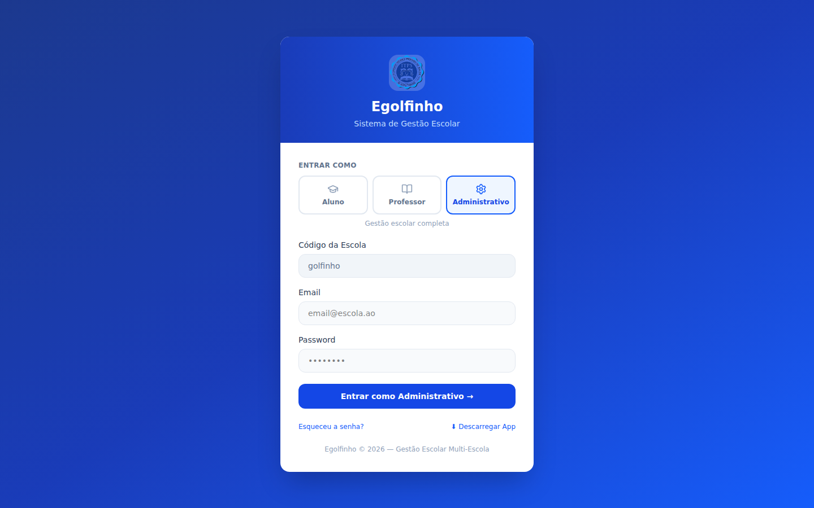

### 2.2 Dashboard

A primeira coisa que vês ao entrar:

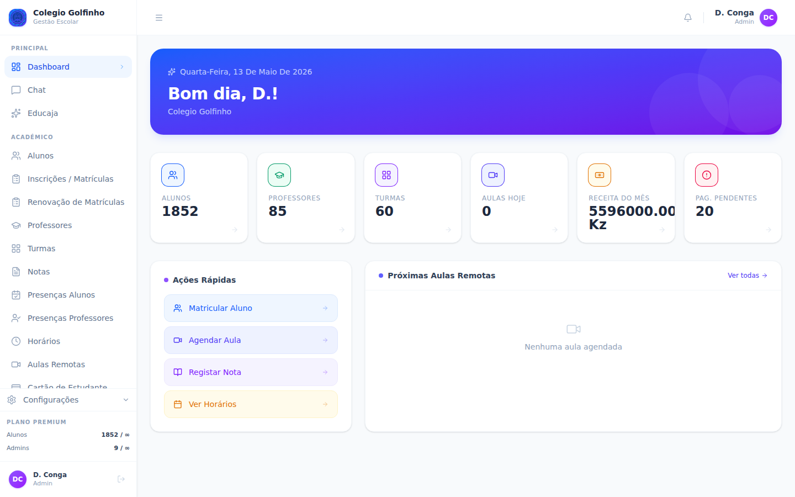

Cards do topo: **Alunos** activos, **Professores**, **Turmas**, **Aulas hoje**, **Receita do mês**, **Pagamentos pendentes**. É a tua vista de controlo diária.

### 2.3 Confirmar dados da escola

Em **Configurações → Dados da Escola** ([/configuracao-escola](configuracao-escola)):

- Nome: **Colégio Golfinho**
- NIF, telefone, endereço — confere.
- **Logotipo** Golfinho carregado (PNG até 2 MB) — aparece em todos os recibos/PDFs.

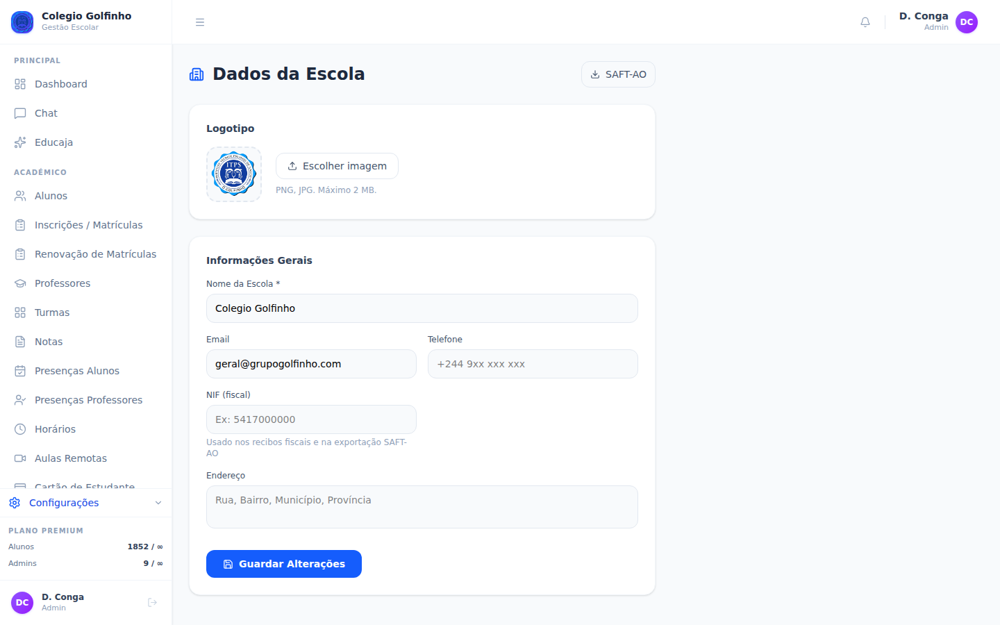

### 2.4 Formato de impressão por defeito

**Configurações → Impressão** ([/configuracao-impressao](configuracao-impressao)):

| Tens na secretaria | Escolhe |
|---|---|
| Impressora A4 partilhada | **A4** |
| Impressora térmica 80 mm | **POS / Térmica** |
| Impressora A5 dedicada | **A5** |

> O operador pode mudar pontualmente na janela de impressão; isto define só o default.

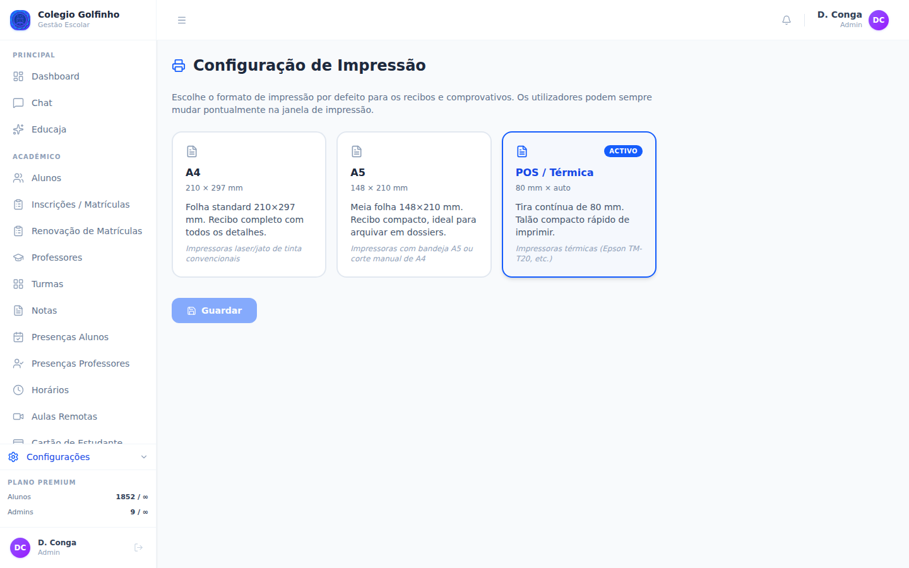

### 2.5 Activar Vendus (se aplicável)

**Configurações → Integração Vendus** ([/integracao-vendus](integracao-vendus)) — passos detalhados em [Manual §3.3](MANUAL_UTILIZADOR.md#33-integração-vendus).

---

## 3. Verificação académica de alunos (fluxo legado)

Esta secção é **específica do Golfinho**.

### 3.1 Porquê existe

Os alunos legados vêm do sistema antigo com matrículas que podem estar **incompletas, em ano lectivo errado ou ligadas a turmas extintas**. Antes de cobrar uma propina, o sistema obriga a confirmar:

- A **turma actual** do aluno.
- O **ano lectivo activo** (default: `2025-2026`).

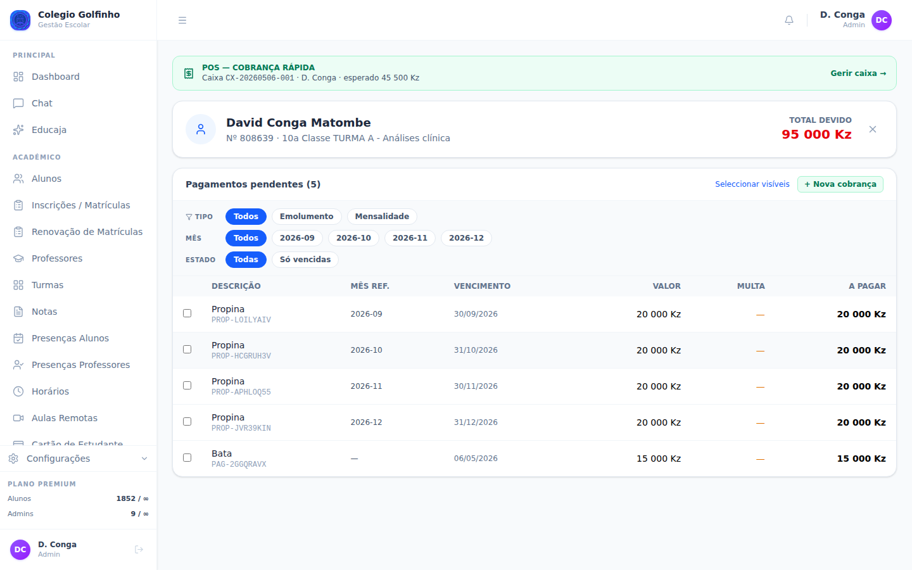

> *Acima:* POS com o aluno **David Conga Matombe (#808639)** seleccionado. Quando a flag de verificação ainda está por confirmar, o modal aparece **antes** desta lista. Após confirmar, vês as dívidas como na imagem e podes marcar as caixinhas para cobrar.

### 3.2 Onde aparece o modal

Sempre que um operador (POS, Tesouraria) selecciona um aluno cuja flag `dados_academicos_verificados_em` esteja a `null`, aparece um modal **"Verificar dados académicos"**.

Pontos de gatilho:
- [/pos](pos) — ao escolher um aluno na pesquisa.
- [/tesouraria](tesouraria) — ao abrir o detalhe de um aluno.
- [/pagamentos](pagamentos) — quando se selecciona pagamentos pendentes desse aluno.

### 3.3 Como o operador resolve

No modal:
1. Confirma o **ano lectivo** (default `2025-2026`).
2. Selecciona a **turma actual** do aluno na lista.
3. Clica **Confirmar**.

O que o sistema faz automaticamente:
- Cria/actualiza a **matrícula activa** do aluno na turma escolhida para o ano lectivo indicado.
- **Fecha** outras matrículas activas desse aluno em anos anteriores (status → `concluida`, com observação automática indicando o utilizador e data).
- Marca `dados_academicos_verificados_em = now()` — o modal não aparece mais para este aluno.

### 3.4 Resetar a verificação (caso tenhas errado a turma)

No perfil do aluno ([/alunos/{id}](alunos)):

1. Scroll até ao card **"Reset Verificação Académica"** (só aparece em escolas com `permite_pago_historico`).
2. Clica **Resetar**.
3. Próxima vez que o aluno for seleccionado no POS, o modal abre de novo.

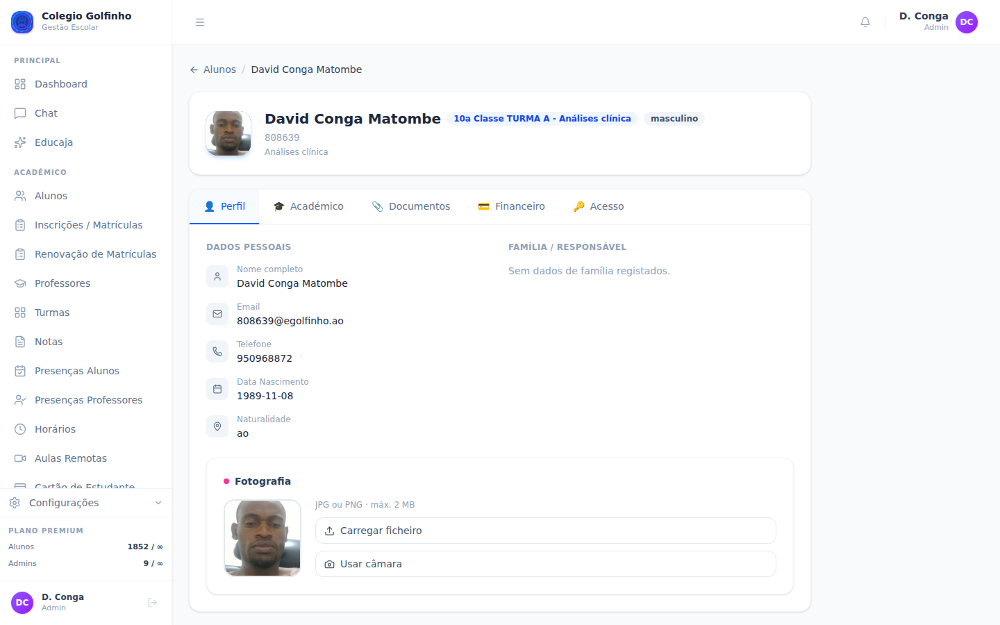

> **Quem deve fazer reset?** Tipicamente só o admin/director, não o operador de caixa. Considera restringir esta acção via permissões ([§4](#4-gestão-de-utilizadores-e-permissões)).

### 3.5 Reset por linha de comando (suporte técnico)

Para casos em massa (raros), o suporte técnico pode usar:

```bash
php artisan golfinho:reset-aluno {aluno_id}
```

---

## 4. Gestão de utilizadores e permissões

### 4.1 Criar conta para um colaborador

[/utilizadores](utilizadores):

1. **Novo Utilizador**.
2. Preenche: nome, email, telefone, perfil base (admin / director / secretaria / tesouraria / professor).
3. Define senha inicial (utilizador é avisado para alterar no 1º login).
4. **Guardar**.

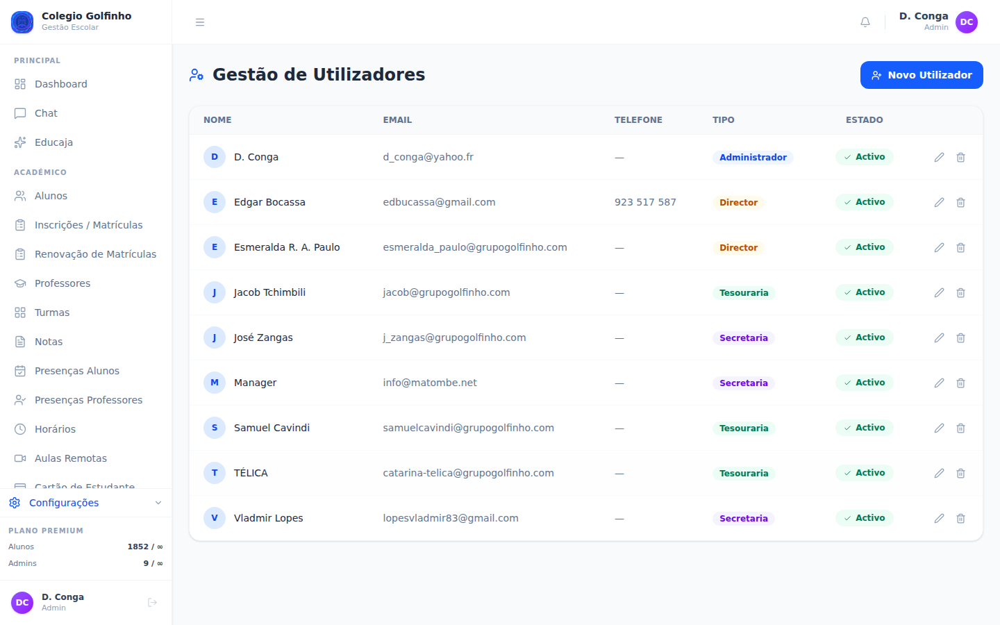

### 4.2 Ajustar permissões finas

[/permissoes](permissoes) → **Gestão de Permissões**:

- Cada utilizador herda permissões do perfil mas podes:
  - **Adicionar** permissões avulsas (ex.: tesouraria que também faz lembretes).
  - **Remover** permissões sensíveis (ex.: secretaria sem acesso a estornos).

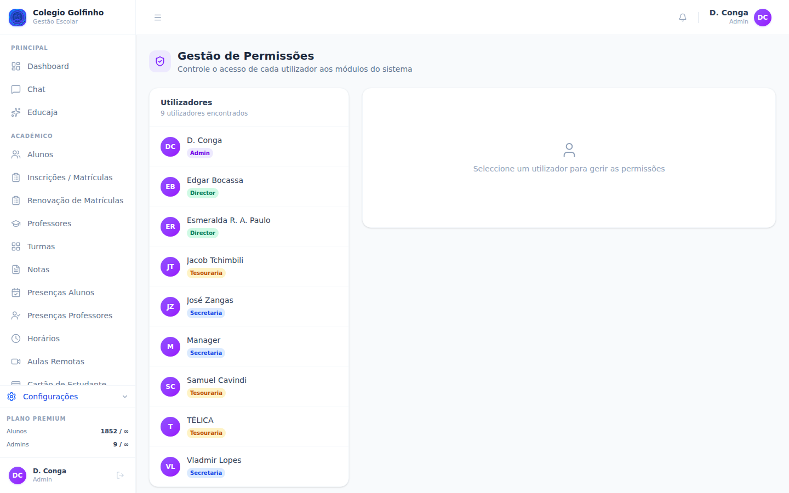

### 4.3 Perfis recomendados para o Golfinho

| Função real | Perfil base | Permissões extra | Permissões a tirar |
|---|---|---|---|
| **Director** | admin | (todas) | — |
| **Subdirector pedagógico** | admin | — | `cobrar_pagamento`, `estornar`, `fechar_caixa` |
| **Tesoureiro** | tesouraria | `gerar_propinas`, `aplicar_multas` | `gerir_utilizadores` |
| **Secretaria geral** | secretaria | — | `estornar`, `reset_verificacao_academica` |
| **Caixa (cobrança)** | tesouraria | — | `estornar`, `gerir_precario` |
| **Professor** | professor | — | (default já é restrito) |

### 4.4 Suspender/desactivar conta

[/utilizadores](utilizadores) → editar utilizador → **Activo: não**. A sessão é encerrada e o login fica bloqueado, mas o histórico de acções fica preservado.

---

## 5. Supervisão financeira diária

### 5.1 Rotina de manhã (5 min)

1. **Dashboard** ([/dashboard](dashboard)) — vê os KPIs do dia anterior: cobranças, dívidas, presenças.
2. **Caixa** ([/caixa](caixa)) — confirma que **todas as caixas do dia anterior foram fechadas**. Se ficou alguma aberta:
   - Filtro **"Sessões abertas"** mostra quais.
   - Contacta o operador responsável OU força fecho com observação (admin pode).
3. **Relatório diário** ([/relatorio-diario](relatorio-diario)) — confere o total cobrado e qualquer diferença de fecho assinalada (sobra/falta).

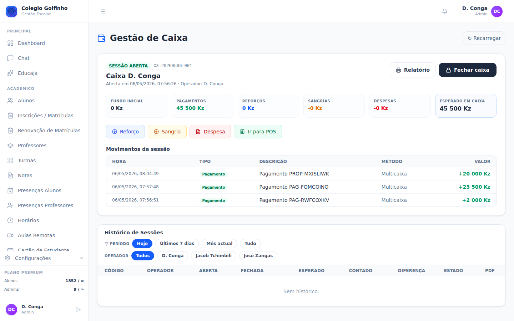

### 5.2 Rotina de fim de dia (10 min)

1. Verifica que **todas as caixas estão fechadas**.
2. **Tesouraria** ([/tesouraria](tesouraria)) — vê o saldo do dia.
3. **Resumo de caixa** (card no topo de [/caixa](caixa)) — totais agregados por operador.
4. Verifica diferenças de fecho:
   - Sobras: investiga (troco a mais? cobrança não registada?).
   - Faltas: investiga e regista observação no card de fecho.

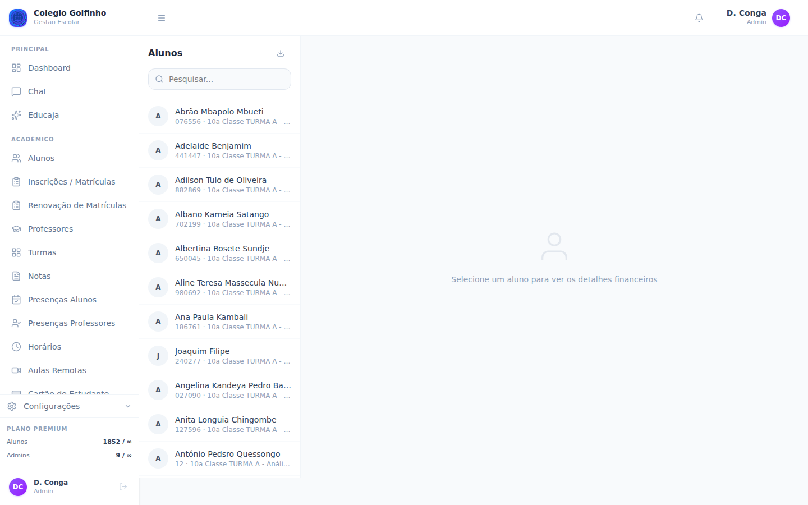

### 5.3 Aprovações sensíveis

Considera fazer apenas o admin ter permissão para:

- **Estornar pagamentos** ([/pagamentos](pagamentos) → ↩ Estornar) — exige motivo ≥5 caracteres, fica histórico.
- **Reset de verificação académica** ([§3.4](#34-resetar-a-verificação-caso-tenhas-errado-a-turma)).
- **Re-emitir Vendus** quando há falha (ícone 🔴 ao lado do pagamento).
- **Gerar propinas do mês** em massa.

---

## 6. Anular um recibo / FR Vendus

> Existem **duas operações distintas** que se confundem facilmente. Para anular completamente um pagamento que já foi cobrado **e** já foi emitido fiscalmente no Vendus, fazem-se **as duas pela ordem indicada**.

### 6.1 Quando usar cada uma

| Situação | Operação | Efeito | Reversível? |
|---|---|---|---|
| Erro interno (cobrou-se ao aluno errado, valor errado, método errado) — **ainda não foi emitido no Vendus** | **Estorno** | Pagamento volta a `pendente`. Pode ser cobrado de novo | Sim — basta voltar a cobrar |
| Cobrança correcta mas **encarregado pediu cancelamento** após emissão fiscal | **Estorno + NC Vendus** | Pagamento marcado `estornado` + Nota de Crédito fiscal a creditar a FR | Não — a NC fica permanente no Vendus |
| Pagamento já anulado internamente, falta só anular a FR no fisco | **Só NC Vendus** | NC fiscal a creditar a FR | Não |

> **Regra de ouro:** se a FR existe no Vendus (ícone 🟢 na lista), também tem de emitir-se a **NC** — caso contrário fica um documento fiscal sem contrapartida e a contabilidade não bate certo.

### 6.2 Como saber o que foi emitido

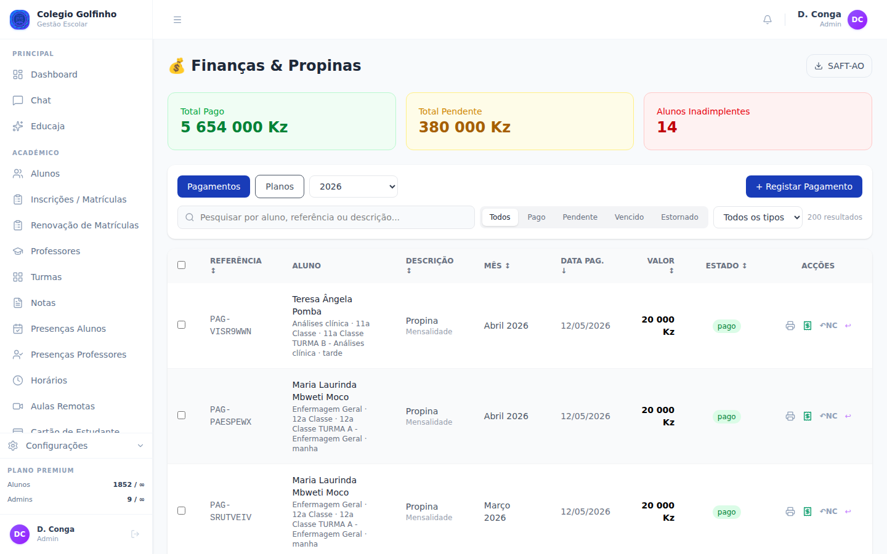

Em [/pagamentos](pagamentos), a coluna **Vendus** mostra ícones por pagamento:

| Ícone | Estado | Acção ao clicar |
|---|---|---|
| 🟢 Recibo (verde) | FR emitida | Abre PDF da FR Vendus |
| 🔴 Alerta (vermelho) | Tentativa de FR falhou | Re-tenta emissão |
| ⚪ Recibo (cinza) | Ainda sem FR | Emite FR agora |
| **NC** (rose) | NC já emitida | Abre PDF da NC |
| **NC!** (vermelho) | Tentativa de NC falhou | Re-tenta NC |
| **↶NC** (cinza) | FR existe, NC ainda não — disponível para emitir | Abre modal de NC |
| **↩** (roxo) | Botão de **estorno** | Abre modal de estorno |

### 6.3 Passo 1 — Estornar o pagamento

Em [/pagamentos](pagamentos), na linha do pagamento a anular:

1. Clica **↩** (roxo) na coluna de acções.
2. Aparece o modal de **Estorno** com:
   - Aluno
   - Referência
   - Valor
3. Preenche o **motivo** (mínimo 5 caracteres). Exemplos:
   - `Cobrança em duplicado — operador trocou aluno`
   - `Encarregado solicitou cancelamento por engano de método`
   - `Anulação contabilística — período fechado`
4. Clica **↩ Confirmar Estorno**.

Resultado:
- Status do pagamento muda para `estornado`.
- `data_pagamento`, `comprovativo` e referência ficam limpos.
- Histórico fica registado: `estornado_em`, `estornado_por`, `estorno_motivo`.
- O pagamento volta a estar disponível para nova cobrança (se o caso for esse).

> **Só pagamentos com estado `pago` podem ser estornados.** Se já estiver `estornado`, o sistema rejeita.

### 6.4 Passo 2 — Emitir Nota de Crédito (NC) no Vendus

Necessário se o pagamento estornado tem `vendus_document_id` preenchido (FR já emitida fiscalmente). Mesmo após o estorno interno, a FR continua válida no Vendus até ser creditada por uma NC.

Na linha do pagamento:

1. Clica **↶NC** (cinza) na coluna Vendus. Se já tinhas tentado e falhou, o botão aparece como **NC!** vermelho — clicar tenta de novo.
2. Aparece o modal **↶ Nota de Crédito Vendus** com:
   - Aluno
   - **Factura Vendus** (ex.: `FR 01P2026/1574`)
   - Valor
   - Aviso amarelo: ⚠️ *Esta acção emite uma Nota de Crédito fiscal no Vendus, creditando a factura acima. É irreversível.*
3. Preenche o **motivo** (5–500 caracteres). Será o texto fiscal da NC. Exemplos:
   - `Anulação por erro de emissão — cobrança duplicada`
   - `Pedido formal de cancelamento do encarregado a {data}`
   - `Anulação por dados de teste introduzidos por engano`
4. Clica **↶ Emitir NC**.

O sistema envia ao Vendus:
- Tipo de documento: `NC`
- `reference_document` apontando para a FR original (linha a linha) — Vendus AO exige isto para gerar a NC.
- Total e items idênticos à FR.

Resultado:
- `vendus_nc_document_id`, `vendus_nc_numero` (ex.: `NC 01P2026/12`) e `vendus_nc_pdf_url` ficam preenchidos.
- A coluna passa a mostrar **NC** rose com link para o PDF da NC.

### 6.5 Erros típicos da NC

| Mensagem | Causa | Solução |
|---|---|---|
| `Factura ainda não foi emitida no Vendus` | Não tem `vendus_document_id` | Estorna o pagamento (não há FR para creditar) |
| `Já existe uma NC para esta factura` | NC já foi emitida | Verifica o ícone **NC** rose na lista — clica para ver o PDF |
| `403 — API key sem permissões` | Conta Vendus não tem permissão de NC | Verifica em [vendus.co.ao](https://www.vendus.co.ao) → Definições → Chaves API |
| `400 — Items não correspondem à FR` | FR original foi alterada manualmente no Vendus | Contactar suporte — pode exigir NC manual no painel Vendus |

### 6.6 Quem deve poder anular

Recomendação para o Golfinho:

| Operação | Perfil mínimo |
|---|---|
| Estorno de pagamento | Tesouraria + permissão `estornar` |
| Emissão de NC Vendus | **Apenas Director / Admin** (acção fiscal irreversível) |

Configura em [/permissoes](permissoes) — restringe `vendus_nota_credito` aos perfis admin/director.

### 6.7 Auditoria

Após estorno + NC, o histórico do pagamento fica:

- `status` = `estornado`
- `estornado_em`, `estornado_por`, `estorno_motivo`
- `vendus_document_id` (FR original) + `vendus_numero` + `vendus_pdf_url`
- `vendus_nc_document_id` (NC de cancelamento) + `vendus_nc_numero` + `vendus_nc_pdf_url`

Isto significa que tens sempre rastreável: **qual a FR**, **qual a NC que a creditou**, **quem fez**, **quando**, **porquê**. Os dois PDFs ficam acessíveis via os ícones na lista de pagamentos.

---

## 7. Preçário e regras de multas

### 7.1 Preçário ([/precario](precario))

Antes do início do ano lectivo, valida:

- **Propinas** por curso/classe — valor mensal e meses aplicáveis.
- **Matrícula** — valor único por curso/classe.
- **Emolumentos** — declarações, certificados, segunda via, etc.

> Mudanças de preçário **não recalculam pagamentos já gerados** — só apanham os próximos. Se precisares de actualizar pagamentos pendentes existentes, faz-lo individualmente em [/pagamentos](pagamentos).

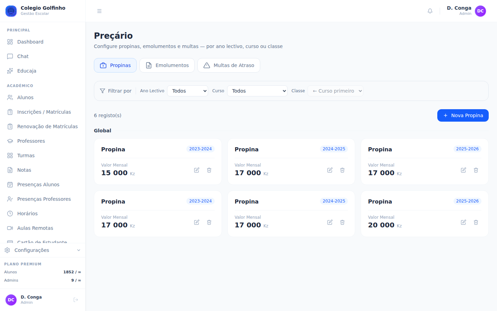

### 7.2 Multas por atraso ([/precario](precario) → aba Multas)

Configuração típica do Golfinho (revê e ajusta):

| Dias após vencimento | Multa |
|---|---|
| 15–19 dias | 350 Kz |
| 20–24 dias | 700 Kz |
| 25+ dias | 3.500 Kz |

A regra aplicada é a com **maior `dias_carencia`** que ainda seja ≤ dias em atraso (escala progressiva).

### 7.3 Gerar propinas mensais

[/pagamentos](pagamentos) → **Gerar propinas do mês**:

- Selecciona mês + ano.
- Cria pagamentos pendentes para **todos os alunos com matrícula activa**.
- Não duplica: se já existe propina daquele mês, salta.
- Bolsas aplicadas automaticamente.

> Tipicamente faz isto **uma vez no início de cada mês** (ex.: dia 1 ou 25 do mês anterior).

---

## 8. Gestão de bolsas e financiadores

A funcionalidade de bolsas permite reduzir o valor que o aluno paga, **mantendo a factura fiscal com o valor cheio**. A diferença (`bolsa_valor`) é o que o financiador cobre, e pode ser facturada separadamente via **recibo de bolsa**.

> **Regra fiscal:** a FR ao aluno fica sempre com o valor cheio (para preservar a contabilidade SAFT). O que o aluno entrega em tesouraria é `valor + multa − bolsa_valor`.

### 8.1 Financiadores ([/financiadores](financiadores))

Antes de criar bolsas, regista os **financiadores** (entidades que pagam por alunos):

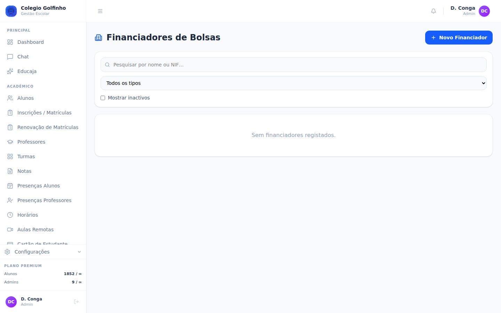

**Tipos disponíveis:**

| Tipo | Quando usar |
|---|---|
| **Interno (escola)** | Bolsa concedida pelo próprio Golfinho (filhos de colaboradores, mérito, etc.) — não emite recibo externo |
| **Governo** | MED, MES, INABE, etc. — emite recibo de bolsa para a tutela |
| **Empresa** | Sonangol, Endiama, etc. — patrocínio corporativo |
| **Fundação** | Lwini, FESA, etc. |
| **Particular** | Indivíduo (padrinho/madrinha pessoal) |
| **Outro** | Caso atípico |

**Campos obrigatórios:**
- **Nome** (texto)
- **Tipo** (lista acima)

**Campos opcionais (recomendados para financiadores externos):**
- NIF (necessário se vai receber recibo fiscal)
- Email, telefone, endereço
- Contacto do responsável (nome da pessoa de contacto)
- Observações

**Activo/inactivo:** desactiva financiadores que já não patrocinam, sem apagar o histórico. Marca **"Mostrar inactivos"** no filtro para revê-los.

### 8.2 Criar uma bolsa ([/bolsas](bolsas) → **+ Nova Bolsa**)

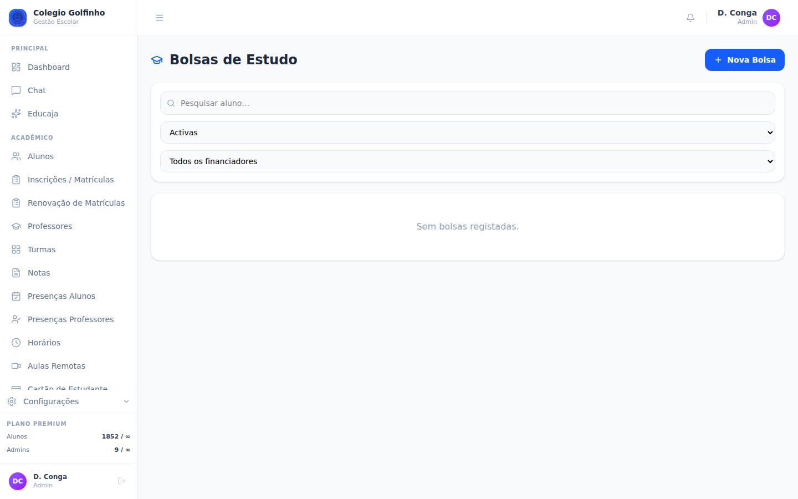

**Campos do formulário:**

| Campo | Detalhe |
|---|---|
| **Aluno** | Pesquisa pelo nome ou número |
| **Matrícula** | Pré-selecciona a matrícula activa do aluno. A bolsa vigora **enquanto a matrícula estiver activa** |
| **Financiador** | Escolhe da lista (deixar vazio = bolsa interna) |
| **Tipo** | `percentagem` (0–100%) ou `valor fixo` (Kz por pagamento) |
| **Valor** | Número — se tipo=%, é a percentagem; se tipo=fixo, é o valor em Kz |
| **Cobre propinas** | ✅ por defeito — desconta nas mensalidades |
| **Cobre emolumentos** | ✅ por defeito — desconta em declarações, certificados |
| **Cobre matrícula** | ✅ por defeito — desconta na matrícula anual |
| **Data início** | Quando a bolsa começa a aplicar-se. Por defeito = hoje |
| **Observações** | Texto livre (ex.: nº do contrato com o financiador) |

> **Exemplo prático:**
> - Bolsa Lwini de 50% que cobre propinas e matrícula mas não emolumentos → tipo=`percentagem`, valor=`50`, ✅ propinas, ❌ emolumentos, ✅ matrícula.
> - Bolsa Sonangol de 30.000 Kz/mês fixo só para propinas → tipo=`fixo`, valor=`30000`, ✅ propinas, ❌ emolumentos, ❌ matrícula.

### 8.3 Aplicação automática

Quando se **gera propinas mensais** ou se **regista um emolumento**, o sistema verifica se há bolsa activa que cobre esse tipo:

- Se houver, calcula o desconto e preenche `bolsa_id`, `bolsa_financiador_id`, `bolsa_valor` no pagamento.
- O `valor` do pagamento mantém-se cheio (para fisco).
- A coluna **A pagar** no POS/Tesouraria mostra o líquido (`valor + multa − bolsa_valor`).
- Se for **bolsa interna** (sem financiador), o desconto aparece igualmente, mas não há recibo de bolsa para emitir.

> Pagamentos **já confirmados como `pago`** **não recalculam** se a bolsa mudar depois — a factura está assinada.

### 8.4 Operações sobre uma bolsa existente

Em [/bolsas](bolsas), na linha da bolsa:

| Acção | Botão | Efeito |
|---|---|---|
| **Editar** | ✏️ | Altera tipo/valor/cobertura. Aplica-se aos **futuros** pagamentos; pagamentos pendentes recalculam quando cobrados |
| **Cancelar** | 🚫 | Modal pede **motivo** (obrigatório). Bolsa fica `cancelada`, `cancelada_em`, `motivo_cancelamento`, `cancelada_por_user_id` ficam registados. **Pagamentos futuros já não terão desconto** |
| **Reactivar** | ↻ | Bolsa cancelada volta a `activa`. Confirma com diálogo |
| **Emitir recibo de bolsa** | 📄 | Só disponível se bolsa tem **financiador externo** e está **activa**. Ver §8.5 |
| **Eliminar** | 🗑 | Apaga permanente. **Não usar se houver pagamentos com `bolsa_id`** apontando para esta — preferir **Cancelar** |

### 8.5 Recibo de bolsa (factura ao financiador)

Para receber do financiador externo, emite-se o **recibo de bolsa** acumulando os valores cobertos num período:

1. Em [/bolsas](bolsas), na linha da bolsa, clica **📄 Emitir recibo**.
2. Indica:
   - **Desde** (data início do período)
   - **Até** (data fim)
   - **Observações** (ex.: "Referente a propinas Jan–Mar/2026 da aluna X")
3. Sistema soma todos os `bolsa_valor` de pagamentos `pago` desse aluno+financiador no intervalo.
4. Gera **PDF** com:
   - Referência única (ex.: `RB-2026-0042`)
   - Dados do financiador
   - Lista detalhada (mês, tipo, valor coberto)
   - Total
   - **QR de verificação** ([/verificar-recibo-bolsa/{escola}/{ref}](verificar-recibo-bolsa))
   - Hash de assinatura digital
5. Entrega ao financiador. O PDF abre automaticamente após emissão.

### 8.6 Quem deve gerir bolsas

Recomendação para o Golfinho:

| Operação | Perfil mínimo |
|---|---|
| Ver bolsas | Admin, Director, Tesouraria |
| Criar/editar/cancelar | **Director ou Admin** (impacto financeiro material) |
| Emitir recibo de bolsa | Tesouraria + permissão `emitir_recibo_bolsa` |
| Eliminar | Apenas Admin |

### 8.7 Revisão anual

No início de cada ano lectivo:

1. Filtra bolsas `activas` em [/bolsas](bolsas).
2. Para cada uma, confirma com o financiador:
   - Continua a patrocinar este aluno?
   - O valor/percentagem mantém-se?
3. As bolsas **não renovam automaticamente** entre anos lectivos — se a matrícula do aluno foi `concluida` e abriu-se nova, a bolsa antiga continua ligada à matrícula antiga e **não se aplica à nova**.
4. **Cria nova bolsa** ligada à nova matrícula activa, ou cancela a antiga se não renovar.

---

## 9. Carteira do aluno (saldo, depósitos e levantamentos)

A **carteira** é uma conta-corrente interna por aluno. Permite:

- Acumular **troco automático** quando o aluno paga em dinheiro mais do que deve.
- Receber **depósitos antecipados** (encarregado adianta valor antes de propinas vencerem).
- **Pagar dívidas usando o saldo** (método `carteira` no POS/Pagamentos).
- **Devolver saldo** ao encarregado via levantamento.

### 9.1 Vista da carteira ([/carteira-aluno](carteira-aluno))

Pesquisa por aluno (nome ou número) e vê o extracto financeiro completo:

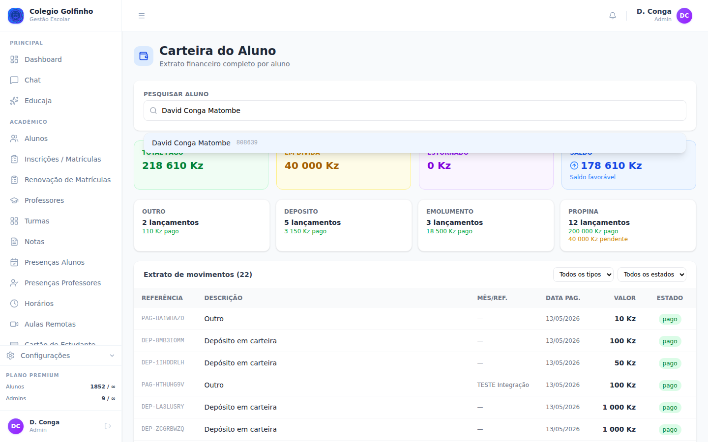

**Cards do topo:**

| Card | Significado |
|---|---|
| 🟢 **Total Pago** | Soma de tudo que o aluno já liquidou (propinas + emolumentos + matrículas) |
| 🟡 **Em Dívida** | Total pendente/vencido — o que falta receber |
| 🟣 **Estornado** | Total de pagamentos anulados (apenas informativo) |
| 🔵 **Saldo** | Crédito em carteira disponível para abater dívidas |

**Saldo positivo** (azul, ⬆️ "Saldo favorável") → aluno tem crédito. Pode ser usado nas próximas cobranças.
**Saldo negativo** (vermelho, ⬇️ "Em dívida") → carteira em défice (raro — investigar).

**Cards por tipo:**

Lista quantos lançamentos há em cada tipo (`Propina`, `Emolumento`, `Matrícula`, `Depósito`) com total pago e pendente.

**Extracto de movimentos:**

Tabela com filtros (tipo, estado) e colunas: Referência, Descrição, Mês/Ref., Data Pagamento, Valor, Estado.

### 9.2 Como o saldo é calculado

```
saldo = depósitos + trocos − levantamentos − pagamentos via carteira
```

Fórmulas operacionais:

| Operação | Efeito no saldo |
|---|---|
| **Depósito** (DEP-xxx) | +valor |
| **Troco automático** (pagamento em dinheiro com excesso) | +excesso |
| **Levantamento** (LEV-xxx) | −valor |
| **Pagamento usando carteira** (método=`carteira`) | −valor pago |
| **Pagamento misto** (parte dinheiro, parte carteira) | −parcela da carteira |

### 9.3 Depositar em carteira

> Exige permissão `carteira_depositar` (admin sempre tem).

No [/pos](pos) com aluno seleccionado OU em [/tesouraria](tesouraria) no detalhe do aluno:

1. Botão **+ Depósito em carteira**.
2. Preenche:
   - **Valor** (Kz)
   - **Método** (dinheiro / transferência / multicaixa / referência)
   - **Nº de referência externa** (obrigatório se método ≠ dinheiro)
   - **Data** (opcional, default hoje)
   - **Observação** (texto livre)
3. **Depositar**.

Resultado:
- Cria pagamento `tipo=deposito`, `status=pago`, `referencia=DEP-xxxxx`.
- Aumenta o saldo da carteira.
- Fica registado na **sessão de caixa activa** (entra como entrada em dinheiro/MC/etc.).
- Pode imprimir-se recibo do depósito.

### 9.4 Levantar saldo da carteira

> Exige permissão `carteira_levantar` (admin sempre tem).

No [/pos](pos) ou [/tesouraria](tesouraria), no aluno:

1. Botão **− Levantar carteira**.
2. Preenche:
   - **Valor** (≤ saldo disponível)
   - **Data** (default hoje)
   - **Observação** (recomendado — ex.: "Devolução por transferência ao colégio")
3. **Levantar**.

Resultado:
- Cria pagamento `tipo=levantamento`, `status=pago`, `metodo=dinheiro`, `referencia=LEV-xxxxx`.
- Diminui o saldo da carteira.
- Sai do caixa físico (movimento de saída).
- Se valor > saldo, o sistema rejeita com erro `Saldo em carteira insuficiente`.

### 9.5 Pagar uma dívida usando saldo da carteira

No POS, ao confirmar uma cobrança:

- **Método=`carteira`** → usa todo o saldo necessário para liquidar (rejeita se saldo < total).
- **Método=`dinheiro` + campo "Valor da carteira"** → pagamento misto: parte da carteira + parte do método principal.

Quando o aluno paga em dinheiro mais do que devia (ex.: deve 18.000 Kz, dá 20.000 Kz):
- O troco de 2.000 Kz vai automaticamente para a carteira.
- Aparece como entrada no extracto da carteira com observação "Troco automático".

### 9.6 Erros típicos da carteira

| Mensagem | Causa | Solução |
|---|---|---|
| `Saldo em carteira insuficiente (necessário X, disponível Y)` | Tentou pagar via carteira ou levantar mais do que o saldo | Confirma o saldo em [/carteira-aluno](carteira-aluno); deposita primeiro se for o caso |
| `Sem permissão para depositar em carteira` | Operador sem `carteira_depositar` | Admin atribui permissão em [/permissoes](permissoes) |
| `Valor da carteira excede o total a pagar` | Pagamento misto onde `valor_carteira > total` | Reduzir o `valor_carteira` para ≤ total devido |

### 9.7 Quem deve poder operar a carteira

Recomendação:

| Operação | Perfil mínimo |
|---|---|
| Consultar carteira | Tesouraria, Secretaria, Director |
| Depositar | Tesouraria + permissão `carteira_depositar` |
| Levantar | **Apenas Director / Admin** (saída de caixa, requer aprovação) |
| Pagar via carteira | Operador POS (já tem na cobrança normal) |

> O troco automático **não exige permissão extra** — é resultado natural de qualquer cobrança em dinheiro.

### 9.8 Auditoria

Toda movimentação na carteira fica como **pagamento** no histórico (com `tipo=deposito|levantamento` ou outro com `valor_carteira > 0`). Isto significa:

- Aparece em [/carteira-aluno](carteira-aluno) (extracto completo).
- Aparece em [/relatorio-diario](relatorio-diario) (movimentos do dia).
- Aparece na **sessão de caixa** do operador que registou.
- Tem **referência** (`DEP-`, `LEV-`, ou `PAG-`).
- Pode ser **estornado** se foi erro (ver [§6](#6-anular-um-recibo--fr-vendus)).

---

## 10. Lembretes automáticos (email/SMS)

[/lembretes](lembretes):

### 10.1 Configuração recomendada para Golfinho

| Quando | Canal | Template |
|---|---|---|
| 5 dias antes do vencimento | Email | "Lembrete amigável" |
| 1 dia antes | Email + SMS | "Lembrete final" |
| 3 dias após vencimento | SMS | "Em atraso" |
| 15 dias após | Email | "Notificação de multa" |

### 10.2 Disparo manual

Em [/pagamentos](pagamentos), ao lado de cada pagamento pendente:
- ✉️ Enviar email
- 💬 Enviar SMS

Útil quando o encarregado liga a perguntar.

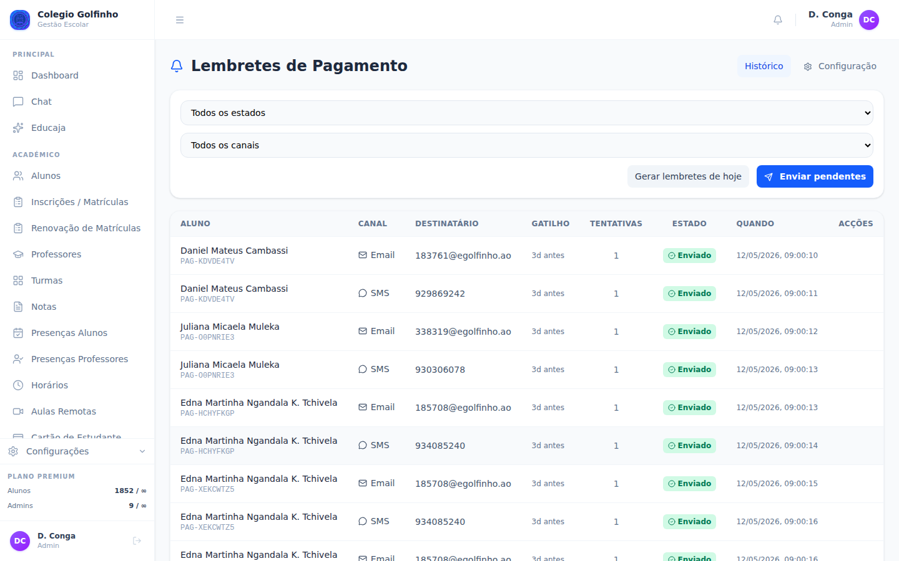

---

## 11. Relatórios e auditoria

| Relatório | Quando consultar | Local |
|---|---|---|
| **Tesouraria** | Diário | [/tesouraria](tesouraria) |
| **Relatório diário** | Final do dia | [/relatorio-diario](relatorio-diario) |
| **Relatório financeiro** | Mensal | [/relatorio-financeiro](relatorio-financeiro) |
| **Controlo de propinas** | Semanal por turma | [/controlo-propinas](controlo-propinas) |
| **Controlo de emolumentos** | Mensal | [/controlo-emolumentos](controlo-emolumentos) |
| **Carteira do aluno** | Sempre que pais pedem extracto | [/carteira-aluno](carteira-aluno) |
| **SAFT-AO** | Trimestral / a pedido AGT | botão `SaftButton` em várias páginas |

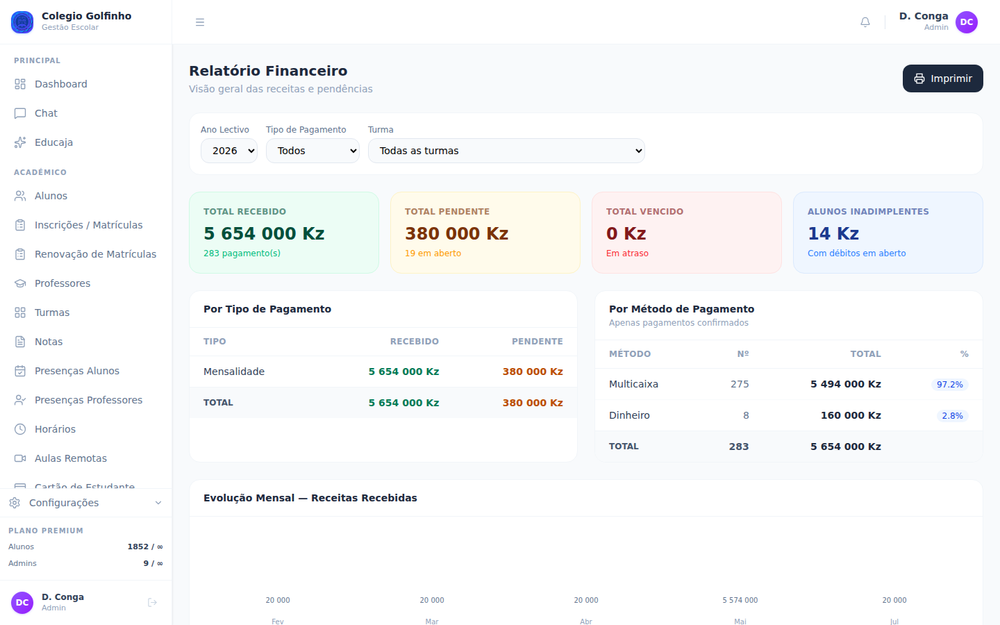

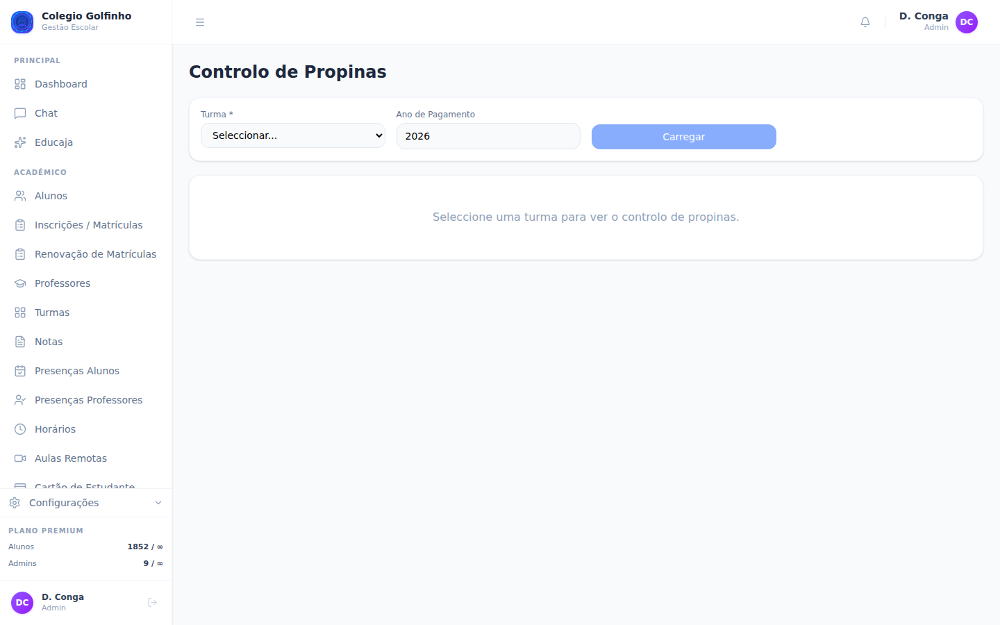

### Auditoria de cobranças

Cada pagamento mostra:
- Quem cobrou (operador).
- Quando (data + hora).
- Que sessão de caixa.
- Se foi emitido no Vendus (e o nº FR).
- Hash de assinatura digital (verificável pelo QR no recibo).

---

## 12. Aluno de teste e ambiente de ensaio

O Golfinho tem um **aluno oficial de teste**:

| Campo | Valor |
|---|---|
| Nome | David Conga Matombe |
| Nº interno | **#1372** |

Este aluno pode ser **resetado livremente** — usa-o para testar:
- Cobranças no POS.
- Modal de verificação académica (faz reset → cobra → reset → repete).
- Lembretes (configura email teste no perfil deste aluno).
- Bolsas (atribui/remove sem afectar dados reais).

> Não uses outros alunos para teste. Cobranças noutros alunos vão para os relatórios reais.

---

## 13. Migração e sincronização do sistema antigo

> Esta secção é técnica — coordena com o suporte antes de executar.

### 13.1 Arquitectura

- **Source**: base de dados `golfinho_source` (cópia do sistema antigo).
- **Destino**: tenant `escola_golfinho` no Educajá.

### 13.2 Comandos disponíveis

**Migração inicial completa** (já executada na implementação):
```bash
php artisan migrar:golfinho           # incremental
php artisan migrar:golfinho --fresh   # limpa destino e re-importa tudo
```

**Sincronização diferencial de pagamentos** (pode ser corrida várias vezes):
```bash
php artisan golfinho:migrar-pagamentos          # dry-run (mostra o que ia mudar)
php artisan golfinho:migrar-pagamentos --force  # executa
```

A chave é `pagamentos.referencia = 'MOV-' + LPAD(movements.id, 8, '0')` — idempotente, só actualiza o que mudou.

### 13.3 Quando correr a sincronização

- Se houve operação no sistema antigo após a migração inicial (transição em curso).
- Se notares que faltam pagamentos legados — verifica primeiro com `php artisan golfinho:migrar-pagamentos` (dry-run).

> **Não correr `--fresh` sem coordenação com o suporte** — apaga dados.

---

## 14. Resolução de problemas — Golfinho

### "Modal de verificação académica não aparece"

→ Confirma em [/utilizadores](utilizadores) que estás autenticado, e que a escola tem `permite_pago_historico = true`. Se aluno foi verificado antes, podes resetar via card no perfil ([§3.4](#34-resetar-a-verificação-caso-tenhas-errado-a-turma)).

### "Aluno legado tem dois registos no sistema"

→ Acontece em raros casos de duplicação na importação. Solução:
1. Identifica qual o registo "bom" (o que tem matrícula activa correcta).
2. No outro: remove a matrícula activa e marca aluno como inactivo.
3. Se houve cobrança no errado, estorna e cobra no certo.
4. Reporta ao suporte com os dois IDs para fusão definitiva.

### "Falta uma propina antiga no histórico do aluno"

→ Provavelmente está em `golfinho_source` mas nunca foi sincronizada. Pede ao suporte para correr:
```bash
php artisan golfinho:migrar-pagamentos --force
```

### "Caixa esquecida aberta de ontem"

→ Admin pode forçar fecho:
1. [/caixa](caixa) → filtro **"Sessões abertas"**.
2. Abre a sessão → **Fechar caixa**.
3. Indica total contado (ou 0 se já não há registo físico).
4. **Observação obrigatória**: "Fecho administrativo — caixa esquecida aberta por {operador} a {data}".

### "Mudei o preçário e os pagamentos antigos não actualizaram"

→ Comportamento esperado. Mudanças no preçário só apanham **futuras** gerações. Para corrigir pagamentos pendentes existentes, edita-os individualmente ou estorna-os e gera novos.

### Outros casos

→ [Manual §14 — Resolução de problemas](MANUAL_UTILIZADOR.md#14-resolução-de-problemas).

---

## Suporte

- Email: `suporte@educaja.com`
- Para questões de migração/sincronização legada: indica que é o **tenant Golfinho** e a operação pretendida.
