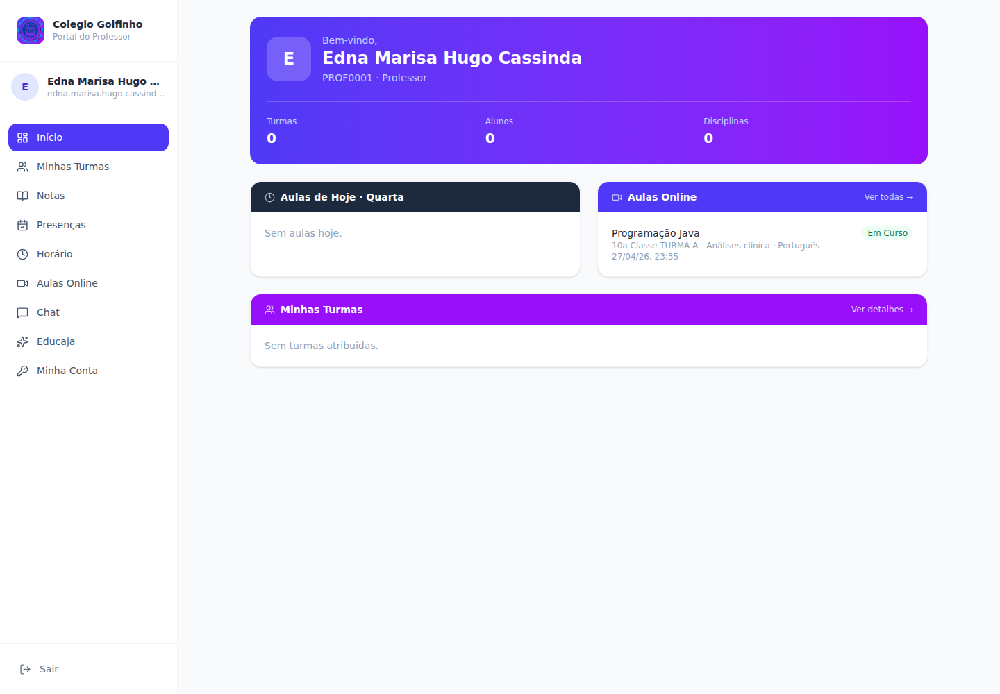
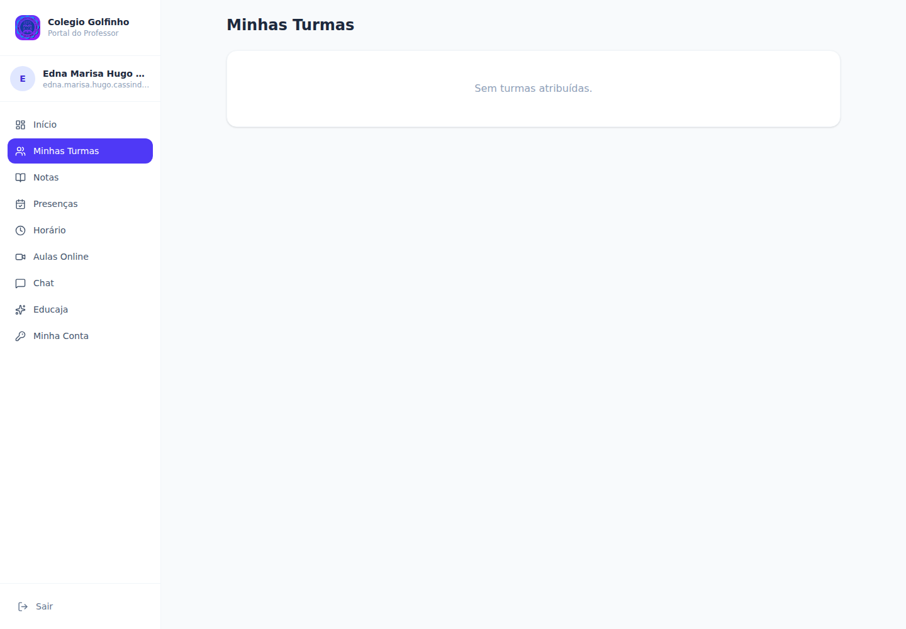
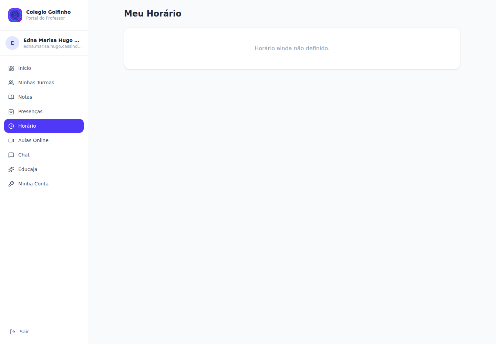
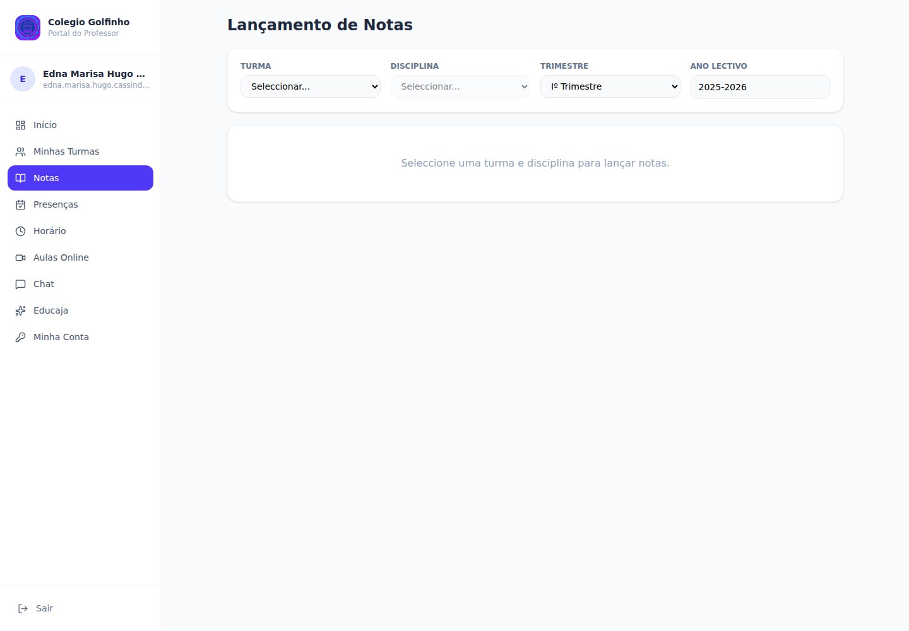
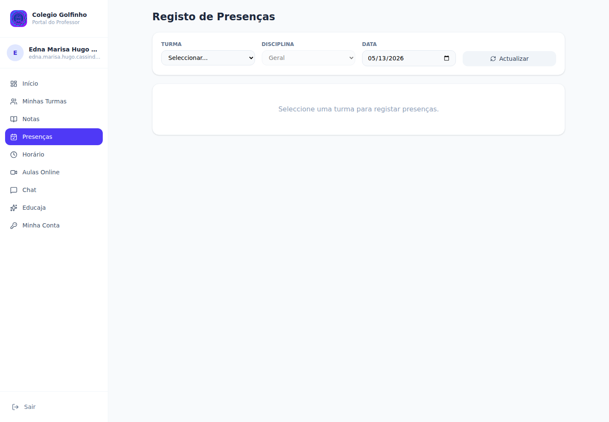
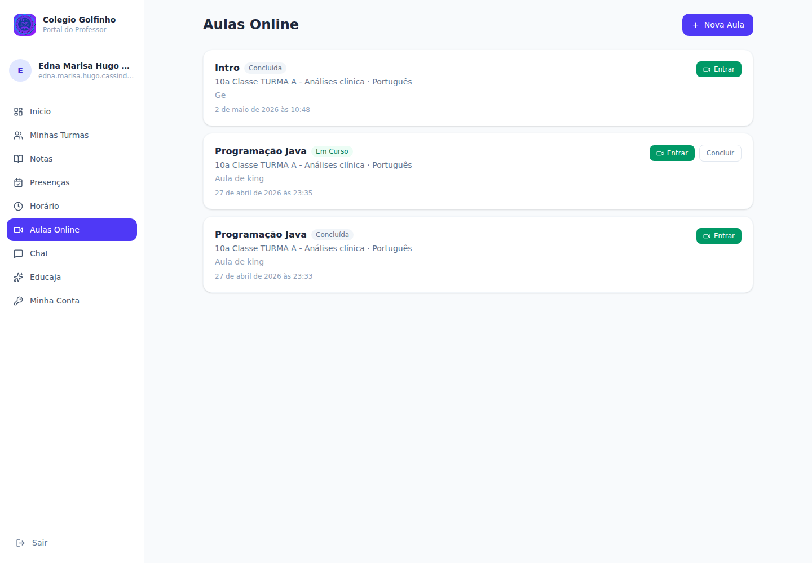
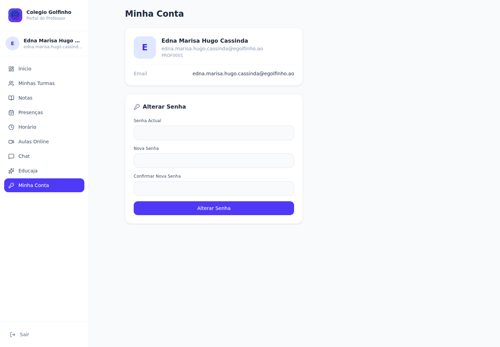

# Guia do Professor — Colégio Golfinho

Manual de bolso para o **professor** do Colégio Golfinho usar o portal Educajá no dia-a-dia.
Última actualização: 2026-05-13.

> Este guia cobre só o **Portal do Professor** (`/professor`). Para questões administrativas (matrículas, financeiro) fala com a secretaria/director.

---

## Índice

1. [Login no Portal do Professor](#1-login-no-portal-do-professor)
2. [Início — vista geral do dia](#2-início--vista-geral-do-dia)
3. [Minhas turmas](#3-minhas-turmas)
4. [Horário semanal](#4-horário-semanal)
5. [Lançar notas](#5-lançar-notas)
6. [Marcar presenças](#6-marcar-presenças)
7. [Aulas online (vídeo-aulas)](#7-aulas-online-vídeo-aulas)
8. [Chat e Comunidade](#8-chat-e-comunidade)
9. [Minha Conta — alterar senha](#9-minha-conta--alterar-senha)
10. [Problemas comuns](#10-problemas-comuns)
11. [Glossário](#11-glossário)

---

## 1. Login no Portal do Professor

1. Abre o navegador em `https://v2.grupogolfinho.com/login`.
2. Em **Entrar como**, clica **Professor** (não confundir com "Administrativo" ou "Aluno").
3. **Código da Escola** já vem preenchido (`golfinho`) — não mexer.
4. **Email** e **Senha** que recebeste do colégio.
5. Clica **Entrar como Professor →**.

> **Primeira vez?** Usa a senha temporária `12345678` (ou a que te foi entregue). Vai a [Minha Conta](#9-minha-conta--alterar-senha) e muda imediatamente.

> **Esqueceste a senha?** Não faças tentativas — pede à secretaria para resetar. Após 3 tentativas falhadas a conta bloqueia.

---

## 2. Início — vista geral do dia

Página inicial do Portal: `/professor`.

### 2.1 Cabeçalho roxo (perfil)

- Tua **foto** ou inicial.
- **Nome** completo.
- **Número de professor** (ex.: `PROF0001`) e especialidade.

### 2.2 Três KPIs

| Card | Significado |
|---|---|
| **Turmas** | Número de turmas atribuídas a ti este ano lectivo |
| **Alunos** | Total de alunos somando todas as tuas turmas |
| **Disciplinas** | Disciplinas distintas que lecciona |

### 2.3 Aulas de Hoje

Lista as aulas que tens hoje, com:
- Hora início – hora fim
- Disciplina + turma

Se "Sem aulas hoje" → significa que hoje não tens aula no horário (ou hoje é fim-de-semana).

### 2.4 Aulas Online

Próximas aulas remotas (vídeo-aulas) ainda **Agendadas** ou **Em Curso**:
- Título da aula
- Turma + disciplina
- Data/hora
- Estado: 🔵 Agendada · 🟢 Em Curso · ⚪ Concluída · 🔴 Cancelada

**Ver todas →** abre [/professor/aulas](professor/aulas).

### 2.5 Minhas Turmas

Resumo de cada turma atribuída:
- Nome da turma
- Curso · turno
- Nº de alunos

**Ver detalhes →** abre [/professor/turmas](professor/turmas).

---

## 3. Minhas turmas

[/professor/turmas](professor/turmas).

Mostra todas as turmas que tens este ano lectivo, com:
- **Nome** da turma (ex.: `10a Classe TURMA A - Análises clínica`)
- **Curso** e **classe**
- **Turno** (manhã / tarde / noite)
- **Disciplinas** que leccionas nessa turma
- **Total de alunos**

> **Não vês a tua turma?** O director ainda não te atribuiu — fala com a coordenação pedagógica.

---

## 4. Horário semanal

[/professor/horario](professor/horario).

Tabela com a tua semana lectiva: **dias × horas**.

Cada célula com aula mostra:
- Disciplina
- Turma
- Sala (se atribuída)

**Como funciona:**
- Horário é definido pela coordenação pedagógica em [/horarios](horarios).
- Se houver alteração (substituição, mudança de sala), reflete-se imediatamente aqui.
- A vista é **semanal repetida** — não muda por semana excepto quando o director altera.

> **Dica:** imprime ou tira foto do teu horário no início do ano e cola na tua secretária.

---

## 5. Lançar notas

[/professor/notas](professor/notas) — uma das funções mais usadas.

### 5.1 Filtros (obrigatórios)

| Campo | O que escolher |
|---|---|
| **Turma** | A turma a que dás aula |
| **Disciplina** | Apenas mostra as disciplinas que **tu** leccionas nessa turma |
| **Trimestre** | Iº Trimestre · IIº Trimestre · IIIº Trimestre |
| **Ano Lectivo** | Default `2025-2026` |

Ao escolher os 4, a tabela de alunos aparece.

### 5.2 Estrutura das notas (Angola)

A nota final de cada trimestre é composta por **3 avaliações**:

| Sigla | Significado | Peso |
|---|---|---|
| **MAC** | Média das Avaliações Contínuas (testes + trabalhos) | 1/3 |
| **NPP** | Nota da Prova do Professor | 1/3 |
| **NPT** | Nota da Prova Trimestral (escrita) | 1/3 |
| **MT** | **Média Trimestral** = (MAC + NPP + NPT) / 3 | calculada |

Há também duas colunas para **faltas** do trimestre:

| Sigla | Significado |
|---|---|
| **FJ** | Faltas Justificadas |
| **FI** | Faltas Injustificadas |

### 5.3 Como lançar

1. Selecciona **turma**, **disciplina**, **trimestre**.
2. Para cada aluno, escreve os valores de 0 a 20 nas colunas **MAC · NPP · NPT**.
3. A coluna **MT** (Média Trimestral) **calcula sozinha** à medida que escreves.
4. Preenche **FJ** e **FI** com o número de faltas.
5. **Tecla Enter** salta automaticamente para o próximo campo — escreve toda a turma sem tirar as mãos do teclado.
6. Clica **💾 Guardar** no final.

### 5.4 Notas com vírgula

Escreve com **ponto** (ex.: `14.5`), não vírgula. Aceita até **1 casa decimal**.

### 5.5 Aluno em falta

- Se um aluno **não fez** a NPT (faltou ao exame): deixa o campo **vazio**.
- A MT calcula com os valores que tiveres (não conta valores vazios como zero).
- Se quiseres explicitamente marcar **zero**, escreve `0`.

### 5.6 Quando posso lançar?

- **Sempre** durante o ano lectivo activo.
- A coordenação pode **fechar** o lançamento de notas após uma data — nesse caso o sistema bloqueia e mostra mensagem. Fala com a coordenação se precisares de corrigir após fecho.

---

## 6. Marcar presenças

[/professor/presencas](professor/presencas) — marcação diária por aula.

### 6.1 Filtros

| Campo | O que escolher |
|---|---|
| **Turma** | A turma da aula |
| **Disciplina** | Opcional — se omitido, marca presença "geral" do dia |
| **Data** | Default hoje. Podes recuar para corrigir dias anteriores |

### 6.2 Três estados de presença

| Botão | Cor | Significado |
|---|---|---|
| **P** | 🟢 verde | **Presente** |
| **FJ** | 🟡 âmbar | **Falta Justificada** (atestado, declaração de saúde, autorização) |
| **FI** | 🔴 vermelho | **Falta Injustificada** |

### 6.3 Como marcar

1. Escolhe **turma** + **disciplina** + **data**.
2. Aparece lista de alunos.
3. Para cada aluno, clica o botão **P / FJ / FI**.
4. Por defeito, todos começam em "presente" → só marcas as faltas.
5. Clica **💾 Guardar** no final.

### 6.4 Imprimir folha de presença

Botão **🖨 Imprimir Folha** abre uma janela com a lista da turma, status de cada aluno, e linha para tua assinatura. Útil para arquivo físico em pasta.

### 6.5 Quando marcar?

**Idealmente no início ou final de cada aula.** Não esperes acumular vários dias — quanto mais tempo passa, mais difícil é lembrar quem faltou.

---

## 7. Aulas online (vídeo-aulas)

[/professor/aulas](professor/aulas) — agendar e dar aulas remotas.

### 7.1 Para que serve

Permite ao professor:
- **Agendar** uma vídeo-aula para uma turma + disciplina.
- **Dar a aula** em chamada vídeo integrada (botão **Entrar**).
- Os alunos vêem no portal deles e juntam-se à mesma sala.

### 7.2 Agendar nova aula (+ Nova Aula)

1. Botão **+ Nova Aula** (canto superior direito).
2. Modal pede:
   - **Turma** (da lista das tuas turmas)
   - **Disciplina** (filtrada às que leccionas nessa turma)
   - **Título** (ex.: `Funções quadráticas — exemplos`)
   - **Descrição** (opcional, agenda da aula)
   - **Data início** + **Data fim** (data + hora — formato `2026-05-15 10:00`)
3. **Guardar**.

Aula aparece na lista com estado **Agendada** 🔵.

### 7.3 Estados da aula

| Estado | Significado | O que podes fazer |
|---|---|---|
| 🔵 **Agendada** | Marcada para o futuro | **Entrar** abre sala (entras antes para preparar) |
| 🟢 **Em Curso** | A acontecer agora | **Entrar** entras na sala · **Concluir** termina |
| ⚪ **Concluída** | Terminada | **Entrar** revê (se gravado) |
| 🔴 **Cancelada** | Cancelada por ti ou coordenação | Só histórico |

### 7.4 Durante a aula

- **Entrar** abre a sala virtual numa nova janela.
- O sistema também envia notificação aos alunos da turma a 10 min do início.
- Liga o microfone e a câmara, partilha ecrã se precisares.

### 7.5 Concluir

No final, volta ao portal e clica **Concluir** na linha da aula — passa a estado `concluida`.

### 7.6 Cancelar

Se precisas cancelar antes da hora, edita a aula e muda o estado para `cancelada`. Os alunos verão a cor vermelha.

---

## 8. Chat e Comunidade

### 8.1 Chat

`/professor/chat` — conversas privadas com:
- Outros professores
- Coordenação / Direcção
- Encarregados de educação dos teus alunos

### 8.2 Comunidade

`/professor/comunidade` — mural partilhado da escola:
- Anúncios da direcção
- Eventos
- Partilha entre colegas
- Educaja (assistente pedagógico)

> Estas duas áreas usam a mesma interface do resto da escola.

---

## 9. Minha Conta — alterar senha

[/professor/conta](professor/conta) — gestão da tua conta.

### 9.1 O que mostra

- **Foto** e nome
- **Email** de login
- **Nº de professor** (ex.: `PROF0001`)

### 9.2 Alterar senha (importante!)

1. **Senha Actual** — a senha que usas para entrar agora.
2. **Nova Senha** — escolhe uma boa:
   - Mínimo 8 caracteres
   - Mistura letras, números e símbolos
   - Não uses datas óbvias (ano de nascimento, etc.)
3. **Confirmar Nova Senha** — repete a nova.
4. Clica **Alterar Senha**.

> **Quando alterar?** Imediatamente no primeiro acesso, e depois pelo menos uma vez por ano lectivo, ou sempre que suspeitares que alguém viu a senha.

### 9.3 Outros dados (foto, email, telefone)

Para alterar **foto, email ou telefone**: fala com a secretaria. O professor só pode mudar a senha aqui — os outros dados são geridos pela administração.

---

## 10. Problemas comuns

### "Não vejo nenhuma turma / disciplina / aluno"
- A coordenação pedagógica ainda não te atribuiu turmas. Fala com o director ou coordenação.

### "Botão Guardar não responde nas notas"
1. Confirma que escolheste **turma + disciplina + trimestre**.
2. Confirma que pelo menos um aluno tem nota.
3. Recarrega com **Ctrl+Shift+R** e tenta de novo.

### "Já lancei mas não aparece quando volto"
- Verifica os **filtros** (turma / disciplina / trimestre / ano). Se mudaste um, vê outro grupo.
- Confirma que clicaste **Guardar** (botão azul no fundo) — sair sem guardar perde tudo.

### "Esqueci a senha"
Não tentes adivinhar muitas vezes — pede à secretaria para resetar. Após reset, voltas a usar a senha temporária e mudas em [Minha Conta](#9-minha-conta--alterar-senha).

### "Erro ao entrar na aula online"
1. Confirma que o teu **navegador** tem permissões de câmara/microfone.
2. **Chrome** ou **Firefox** funcionam melhor.
3. Se persistir: fecha a aba, abre nova, tenta de novo.
4. Se a sala diz "não existe", a aula pode estar cancelada ou em estado errado.

### "Não consigo lançar notas — sistema diz fechado"
A coordenação fechou o lançamento para esse trimestre. Pede autorização à direcção para reabertura.

### "Notas não somam o que esperava"
A MT é a **média aritmética** de MAC, NPP, NPT. Verifica os valores escritos — vírgula vs ponto pode confundir. Aceita só **ponto**: `14.5`, não `14,5`.

### "Vejo turmas/notas de outro professor"
Não devias. **Reporta imediatamente** ao director — pode ser bug ou acesso indevido.

---

## 11. Glossário

| Termo | Significado |
|---|---|
| **PROF0001** | Formato do número de professor (sequencial) |
| **Turma** | Grupo fixo de alunos numa classe (ex.: `10a Classe TURMA A`) |
| **Classe** | Ano lectivo escolar (10ª, 11ª, 12ª, 13ª) |
| **Disciplina** | Cadeira/matéria (Matemática, Português, etc.) |
| **MAC** | Média das Avaliações Contínuas (testes, trabalhos durante o trimestre) |
| **NPP** | Nota da Prova do Professor |
| **NPT** | Nota da Prova Trimestral (exame escrito do trimestre) |
| **MT** | Média Trimestral = (MAC + NPP + NPT) / 3 |
| **FJ** | Falta Justificada (com documento) |
| **FI** | Falta Injustificada |
| **Trimestre** | Período de avaliação (Iº, IIº, IIIº — três por ano lectivo) |
| **Aula online** | Aula em vídeo-chamada via portal Educajá |
| **Educaja** | Assistente pedagógico AI integrado |

---

## Suporte

- **Dúvidas pedagógicas / horários / turmas:** Coordenação pedagógica do Golfinho.
- **Senha / acesso / configuração:** Secretaria.
- **Problemas técnicos persistentes:** `suporte@educaja.com`.

Bom trabalho! 🎓
