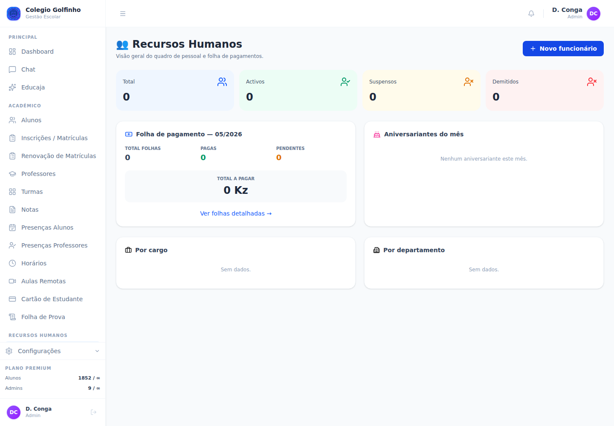
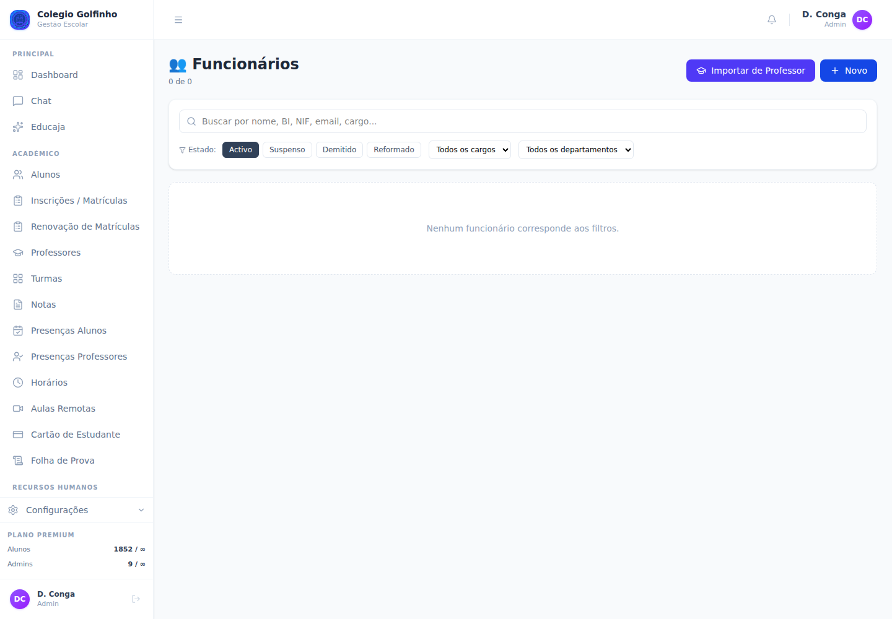
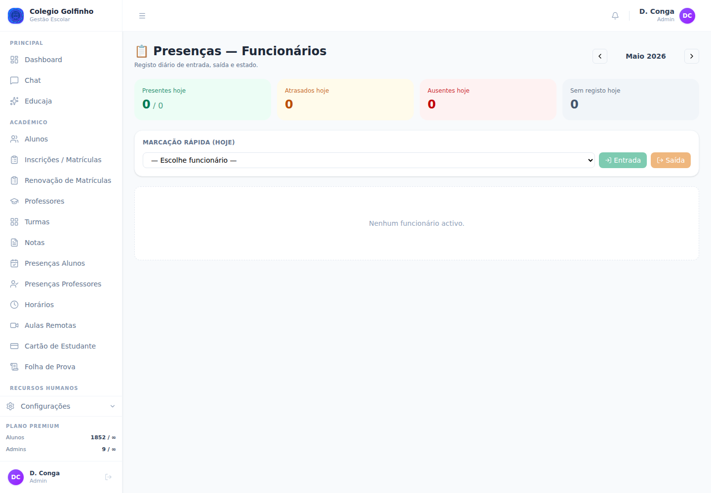
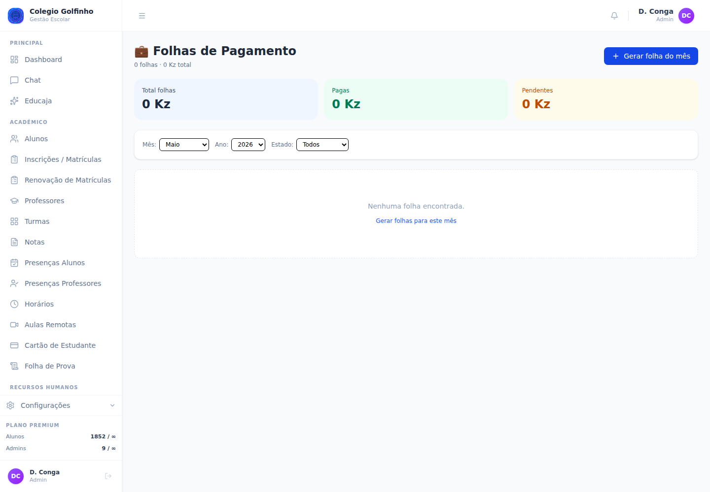

# Guia de Recursos Humanos — Colégio Golfinho

Manual operacional do **módulo RH** do Educajá: gestão de funcionários, folha de pagamento e presenças.
Última actualização: 2026-05-13.

> Para gestão financeira de alunos, ver [Guia do Administrador](GUIA_ADMIN_GOLFINHO.md). Para operações de caixa, ver [Guia da Tesouraria](GUIA_TESOURARIA_GOLFINHO.md).

---

## Índice

1. [Visão geral e fluxo](#1-visão-geral-e-fluxo)
2. [Dashboard RH](#2-dashboard-rh)
3. [Gestão de funcionários](#3-gestão-de-funcionários)
4. [Importar professores como funcionários](#4-importar-professores-como-funcionários)
5. [Presenças e ponto](#5-presenças-e-ponto)
6. [Folha de pagamento (ciclo mensal)](#6-folha-de-pagamento-ciclo-mensal)
7. [Subsídios e descontos](#7-subsídios-e-descontos)
8. [Anular ou eliminar folha](#8-anular-ou-eliminar-folha)
9. [Recibos de salário (PDF)](#9-recibos-de-salário-pdf)
10. [Permissões recomendadas](#10-permissões-recomendadas)
11. [Problemas comuns](#11-problemas-comuns)
12. [Glossário](#12-glossário)

---

## 1. Visão geral e fluxo

O módulo RH cobre três áreas interligadas:

```
┌──────────────────┐    ┌─────────────────┐    ┌──────────────────────┐
│ 1. Funcionários  │ →  │ 2. Presenças    │ →  │ 3. Folha pagamento   │
│ (cadastro)       │    │ (ponto diário)  │    │ (mensal, recibos)    │
└──────────────────┘    └─────────────────┘    └──────────────────────┘
        ↑
   Importar de
   /professores
```

**Ciclo mensal típico:**

1. Manter cadastro de funcionários actualizado (admissões, demissões, alterações de salário).
2. Registar presenças diárias (clock-in / clock-out / faltas / férias).
3. No final do mês, **gerar folha** para todos os funcionários activos.
4. Editar cada folha (subsídios, descontos extras).
5. **Processar** → **Pagar** → **gerar recibo** para o funcionário.

---

## 2. Dashboard RH

Menu lateral → **Recursos Humanos → Dashboard** ([/rh](rh)).



**Cards do topo (quadro de pessoal):**

| Card | Significado |
|---|---|
| 🔵 **Total** | Todos os funcionários cadastrados (qualquer estado) |
| 🟢 **Activos** | Em funções actualmente |
| 🟡 **Suspensos** | Temporariamente afastados (baixa, licença prolongada) |
| 🔴 **Demitidos** | Desligados (mantém-se para histórico/folhas anteriores) |

**Folha de pagamento — mês corrente:**

- **Total folhas** geradas para o mês.
- **Pagas** vs **Pendentes**.
- **Total a pagar** (Kz) — soma dos líquidos pendentes.
- Link **Ver folhas detalhadas →** abre [/rh/folhas](rh/folhas).

**Aniversariantes do mês:** lista de funcionários a fazer anos no mês corrente — útil para gestos da escola.

**Distribuições:** dois gráficos com a repartição por **cargo** e por **departamento**, com barras de percentagem.

> **Botão "+ Novo funcionário"** no canto superior direito → atalho directo para criar.

---

## 3. Gestão de funcionários

[/rh/funcionarios](rh/funcionarios) — lista, criar, editar, ver detalhe.



### 3.1 Pesquisa e filtros

- **Caixa de pesquisa**: procura por nome, BI, NIF, email ou cargo.
- **Estado** (default: Activos) — Activos · Suspensos · Demitidos · Reformados.
- **Cargo** — gerado automaticamente a partir dos cargos existentes.
- **Departamento** — idem.

### 3.2 Criar funcionário ("+ Novo funcionário")

**Dados pessoais (obrigatórios:** nome**)**

| Campo | Detalhe |
|---|---|
| **Nome** | Nome completo |
| BI | Bilhete de identidade (sem traços, ex.: `001234567BA046`) |
| NIF | Necessário se vais emitir recibo fiscal |
| Telefone, Email, Morada | Contactos |
| Foto | JPG/PNG até 2 MB |
| Género | masculino · feminino |
| Data nascimento | Para aniversariantes + idade |
| Naturalidade | País/província |
| Estado civil | solteiro · casado · divorciado · viúvo |

**Dados profissionais:**

| Campo | Detalhe |
|---|---|
| **Cargo** | Texto livre (ex.: "Professor", "Coordenador Pedagógico", "Tesoureiro"). Usado nas distribuições do dashboard |
| **Departamento** | Texto livre (ex.: "Pedagógico", "Administrativo", "Manutenção") |
| **Tipo de contrato** | efectivo · temporário · estagiário · tarefeiro |
| **Data de admissão** | Quando começou (default: hoje) |
| **Data de fim** | Apenas para contratos a termo |
| **Salário base** | Em Kz — valor mensal bruto. Vai para a folha de pagamento |
| **IBAN, Banco** | Conta para transferência salarial |

**Estado e demissão:**

| Campo | Detalhe |
|---|---|
| **Estado** | activo · suspenso · demitido · reformado |
| **Data demissão** | Quando se demite/é demitido |
| **Motivo demissão** | Texto livre (justa causa, rescisão amigável, etc.) |
| **Observação** | Notas internas |

> **Demissão preserva histórico:** marcar `demitido` **não apaga** o funcionário — fica visível com filtro "Demitidos" e folhas anteriores continuam acessíveis.

### 3.3 Editar funcionário

Linha do funcionário → ícone de edição. Mesmo formulário, com dados preenchidos.

> Alterações ao **salário base** afectam **folhas futuras**. Folhas já em rascunho podem ser actualizadas manualmente; folhas pagas ficam congeladas.

### 3.4 Ver detalhe

Clica no nome do funcionário → [/rh/funcionarios/{id}](rh/funcionarios). Vê:
- Dados pessoais e profissionais.
- Folhas de pagamento históricas.
- Resumo de presenças do mês actual.

---

## 4. Importar professores como funcionários

Para evitar duplicação, há um **import directo** dos professores já cadastrados em [/professores](professores) para o RH.

### Como funciona

1. Em [/rh/funcionarios](rh/funcionarios), clica **Importar professor**.
2. Aparece lista de **professores sem funcionário associado**.
3. Selecciona o professor.
4. Preenche dados RH específicos:
   - Cargo (default "Professor")
   - Departamento (sugere o departamento do professor se houver)
   - Tipo de contrato (default `efectivo`)
   - Salário base
5. **Importar**.

O funcionário fica criado com:
- Mesmos dados pessoais do professor (nome, email, contactos).
- Ligação `professor_id` ao registo original → presenças e horários ficam sincronizados.

> Cada professor só pode ser importado uma vez. Depois aparece já como funcionário e não na lista de import.

---

## 5. Presenças e ponto

[/rh/presencas](rh/presencas) — registo diário de ponto.



### 5.1 Cards do topo (hoje)

| Card | Significado |
|---|---|
| 🟢 **Presentes hoje** | X / Y → de Y activos, X estão presentes |
| 🟡 **Atrasados hoje** | Marcações com estado "atrasado" |
| 🔴 **Ausentes hoje** | Faltas (não justificadas) |
| ⚪ **Sem registo hoje** | Funcionários activos sem nenhuma marcação |

### 5.2 Marcação rápida (clock-in / clock-out)

Card **"Marcação Rápida (Hoje)"**:

1. **Escolhe funcionário** na lista.
2. Clica **➜ Entrada** → marca hora actual como entrada (status `presente` se for nas horas normais, `atrasado` se for depois).
3. No fim do turno, escolhe o mesmo funcionário e clica **➜ Saída** → marca hora de saída e calcula horas trabalhadas.

> Este é o uso ideal num **leitor de impressão digital ligado por USB** ou tablet à entrada — mas funciona em qualquer browser.

### 5.3 Grelha mensal

Tabela com **linhas = funcionários**, **colunas = dias do mês**. Cada célula mostra um símbolo curto:

| Símbolo | Cor | Estado |
|---|---|---|
| **P** | 🟢 verde | Presente |
| **A** | 🟡 âmbar | Atrasado |
| **F** | 🔴 vermelho | Ausente (falta não justificada) |
| **FJ** | 🔵 azul | Falta justificada |
| **Fe** | 🟣 roxo | Férias |
| **BM** | 🌸 rosa | Baixa médica |
| **Fg** | ⚪ cinza | Folga |

### 5.4 Editar uma marcação

Clica numa célula da grelha → modal com:
- **Estado** (lista acima)
- **Entrada** (hh:mm) — se aplicável
- **Saída** (hh:mm) — se aplicável (calcula horas automaticamente)
- **Justificação** — obrigatório se estado for `falta_justificada`, `baixa_medica`
- **Observação** — texto livre

**Guardar** → marca persiste na grelha.

### 5.5 Navegação mensal

Setas ◀ / ▶ no topo (ou no card de "Maio 2026") avançam/recuam um mês. Útil para corrigir marcações antigas ou rever histórico.

---

## 6. Folha de pagamento (ciclo mensal)

[/rh/folhas](rh/folhas) — gestão da folha de cada mês.



### 6.1 Resumo do topo

Três cards mostram o que está filtrado:
- **Total folhas** — soma dos líquidos.
- **Pagas** (verde).
- **Pendentes** (âmbar) — `total − pagas`.

### 6.2 Filtros

- **Ano** + **Mês** — default: mês corrente.
- **Estado** — Rascunho · Processada · Paga · Anulada.

### 6.3 Gerar folha do mês (em massa)

> **Acção principal** — botão **+ Gerar folha do mês**.

1. Selecciona **Mês** + **Ano**.
2. **Gerar**.

O sistema:
- Pega em **todos os funcionários `activo`**.
- Para cada um, **cria uma folha em `rascunho`** com:
  - `salario_base` igual ao do funcionário no momento.
  - `subsídios = []`, `descontos = []`.
  - `liquido = salario_base`.
- **Não duplica:** se já existe folha desse mês para o funcionário, salta.
- Mostra: `Geradas X folha(s). Y já existiam.`

> Podes correr **mais que uma vez** no mesmo mês — só adiciona o que falta (útil quando admites um funcionário a meio do mês).

### 6.4 Estados da folha

```
   rascunho ──processar──▶ processada ──pagar──▶ paga
       │                                          
       └──anular──▶ anulada
       │
       └──delete──▶ (apaga)
```

| Estado | Significado | Pode editar? |
|---|---|---|
| **Rascunho** (cinza) | Acabada de criar — pronta a editar | ✅ Sim |
| **Processada** (azul) | Subsídios/descontos confirmados, aguarda pagamento | ✅ Sim (até pagar) |
| **Paga** (verde) | Pago ao funcionário | ❌ Não — só anular |
| **Anulada** (vermelho) | Cancelada com motivo | ❌ Não |

### 6.5 Editar uma folha

Clica na linha → [/rh/folhas/{id}](rh/folhas) (detalhe).

Campos editáveis (enquanto não estiver `paga`):
- **Salário base** (sobrescreve para esta folha — útil para reajustes pontuais).
- **Subsídios** — array de `{nome, valor}` (ver §7).
- **Descontos** — array de `{nome, valor}` (ver §7).
- **Observação** — notas (ex.: "Inclui subsídio de férias proporcional").

O **Líquido** recalcula automaticamente: `liquido = salario_base + total_subsidios − total_descontos`.

### 6.6 Processar

Quando os subsídios/descontos estão revistos e correctos:

1. Botão **Processar**.
2. Folha passa a estado `processada` (cor azul).
3. Continua editável, mas marca formalmente que está revista pelo RH.

### 6.7 Pagar

> Só aplicável a folhas `rascunho` ou `processada`.

1. Botão **Marcar como paga**.
2. Modal pede:
   - **Método**: dinheiro · transferência · multicaixa · cheque
   - **Data de pagamento** (obrigatório)
   - **Referência externa** (opcional — nº de transferência, nº de cheque, etc.)
3. **Confirmar**.

Folha passa a `paga` (verde). **Já não pode ser editada** — só anulada.

---

## 7. Subsídios e descontos

A folha aceita listas livres de subsídios e descontos. Cada item tem **nome** + **valor**.

### 7.1 Subsídios típicos no Golfinho

| Nome | Quando aplicar |
|---|---|
| **Subsídio de transporte** | Mensal fixo para todos (ex.: 15.000 Kz) |
| **Subsídio de alimentação** | Mensal por dia útil ou fixo |
| **Subsídio de férias** | Anual em Junho/Julho (ex.: salario_base × 50%) |
| **Subsídio de Natal** | Em Dezembro (ex.: salario_base × 100%) |
| **Bónus de produtividade** | Avulso, conforme decisão da direcção |
| **Prémio de assiduidade** | Mensal se zero faltas |
| **Horas extra** | Conforme registadas em presenças |

### 7.2 Descontos típicos

| Nome | Quando aplicar |
|---|---|
| **INSS — funcionário** | 3% do salário base (em Angola) |
| **IRT — Imposto sobre rendimento** | Escalões progressivos AGT |
| **Adiantamento salarial** | Se foi feito durante o mês |
| **Falta de dias** | Se houve faltas não justificadas (`salario_base / 22 × dias`) |
| **Avarias / equipamentos** | Caso aplicável e acordado |
| **Sindicato** | Quota mensal |

### 7.3 Como adicionar

No detalhe da folha:

1. **Adicionar subsídio** / **Adicionar desconto**.
2. **Nome** (texto livre, será descritivo no recibo).
3. **Valor** (Kz).
4. Repete para tantos quantos forem necessários.
5. **Guardar**.

O líquido recalcula em tempo real.

### 7.4 Modelos por defeito

> Sugestão: define um padrão por escrito (ex.: política RH do Golfinho) e usa nomes consistentes — facilita relatórios e auditorias.

---

## 8. Anular ou eliminar folha

### 8.1 Anular (folha paga ou processada)

Para "cancelar" uma folha que já está paga (e não consegues editar):

1. No detalhe → botão **Anular**.
2. **Motivo** (obrigatório, texto livre).
3. **Confirmar**.

Folha passa a `anulada`. O motivo é gravado na observação como `[ANULADA: motivo]`.

> **Anular não devolve dinheiro automaticamente.** Se já pagaste por transferência, tens de:
> 1. Registar a devolução noutro lado (extorno em conta).
> 2. Anular esta folha com motivo claro.
> 3. Gerar nova folha correcta se necessário.

### 8.2 Eliminar (apenas rascunhos)

Folhas em estado `rascunho` (nunca processadas ou pagas) podem ser eliminadas:

- No detalhe → **Eliminar**.
- Folhas **pagas não podem ser eliminadas** — só anuladas.

---

## 9. Recibos de salário (PDF)

Após pagar uma folha, gera-se o **recibo de salário** em PDF (A4) para entrega ao funcionário.

### Como descarregar

Na linha da folha (lista) ou no detalhe:
- Botão **📄 Recibo** ou ícone Download.
- O PDF descarrega com nome `recibo-{referencia}.pdf` (ex.: `recibo-FOLHA-A1B2C3D4.pdf`).

### O que aparece no recibo

- Cabeçalho com logo + dados do colégio (NIF, endereço, telefone, email).
- Dados do funcionário (nome, BI, NIF, cargo, departamento).
- Período (Mês/Ano).
- Referência única da folha.
- **Salário base**.
- **Tabela de subsídios** (linha a linha).
- **Tabela de descontos** (linha a linha).
- **Líquido a receber**.
- Método e data de pagamento, referência externa.
- Linhas para assinaturas: empregador / trabalhador.

---

## 10. Permissões recomendadas

Para o Golfinho:

| Operação | Perfil mínimo |
|---|---|
| Ver dashboard RH e funcionários | Admin, Director, Coordenador RH |
| Criar/editar funcionário | Admin, Director |
| Importar professor → funcionário | Admin, Director |
| Demitir | **Director** (só) |
| Registar presenças | RH, Director, ou cada funcionário no próprio ponto |
| Gerar folha do mês | Admin ou Director |
| Editar subsídios/descontos | RH ou Tesouraria |
| Pagar folha | **Tesouraria + Director** (dupla validação) |
| Anular folha paga | **Apenas Director** (impacto contabilístico) |

Configura cada permissão em [/permissoes](permissoes) por utilizador, conforme as funções reais.

---

## 11. Problemas comuns

### "Folhas não geradas para um funcionário"
Verifica que o funcionário está com **estado = activo**. Suspensos, demitidos e reformados não recebem folha automática.

### "Folha não pode ser editada"
A folha está com estado `paga`. Para alterar:
1. **Anula** com motivo.
2. Gera **nova folha** corrigida — atenção: tens de coordenar a devolução/ajuste manualmente, o sistema não faz estorno automático.

### "Erro a importar professor"
A lista mostra só **professores sem funcionário**. Se não aparece o que procuras, confirma se já foi importado antes (vê em [/rh/funcionarios](rh/funcionarios) → filtra por cargo "Professor").

### "Total de horas trabalhadas errado"
A grelha calcula `saida − entrada` automaticamente. Se as horas estão erradas, confirma:
- Formato hh:mm correcto (24h).
- Não há sobreposição de marcações no mesmo dia.
- O fuso horário do servidor (deve ser **Africa/Luanda**).

### "Funcionário não consegue marcar presença"
1. Confirma estado `activo`.
2. Se faz clock-in pelo browser, garante que está autenticado.
3. Para leitor biométrico, é necessário integração específica — contactar suporte.

### "Líquido negativo"
Os descontos excedem `salario_base + subsídios`. Reduz descontos ou aumenta subsídios para repor.

---

## 12. Glossário

| Termo | Significado |
|---|---|
| **Funcionário** | Pessoa que recebe salário da escola (professor, administrativo, manutenção) |
| **Cargo** | Posição/função (Professor, Coordenador, Tesoureiro) |
| **Departamento** | Área da escola (Pedagógico, Administrativo, Manutenção) |
| **Tipo de contrato** | efectivo · temporário · estagiário · tarefeiro |
| **Salário base** | Valor mensal bruto antes de subsídios e descontos |
| **Subsídio** | Valor adicional ao salário (transporte, alimentação, férias, Natal) |
| **Desconto** | Valor subtraído ao salário (INSS, IRT, faltas, adiantamentos) |
| **Líquido** | `salario_base + total_subsídios − total_descontos` — o que o funcionário recebe |
| **Folha de pagamento** | Documento mensal com cálculo do salário de um funcionário |
| **Rascunho** | Folha criada mas ainda em edição |
| **Processada** | Folha revista pelo RH, aguarda pagamento |
| **Paga** | Folha já liquidada ao funcionário |
| **Anulada** | Folha cancelada com motivo |
| **Clock-in / Clock-out** | Marcação de entrada / saída no ponto |
| **Grelha de presenças** | Tabela mensal de estados por funcionário e dia |
| **Recibo de salário** | PDF entregue ao funcionário a comprovar o pagamento |

---

## Suporte

- Dúvidas operacionais do dia-a-dia: director do colégio.
- Questões técnicas do sistema: `suporte@educaja.com`.
