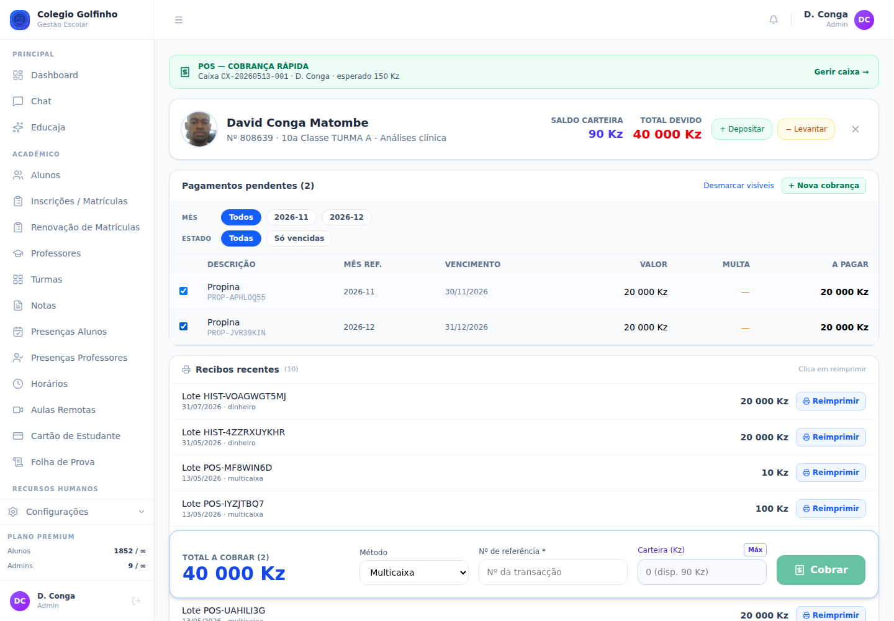

# Guia da Tesouraria — Colégio Golfinho

Manual de bolso para o **operador de caixa** do Colégio Golfinho.
Cobre o dia-a-dia da cobrança: abrir caixa → atender alunos no POS → fechar caixa.
Última actualização: 2026-05-13.

> Para gestão da escola (utilizadores, bolsas, preçário, relatórios) consulta o [Guia do Administrador](GUIA_ADMIN_GOLFINHO.md).

---

## Índice

1. [Antes de começar](#1-antes-de-começar)
2. [Abrir a caixa](#2-abrir-a-caixa)
3. [POS — cobrar a um aluno](#3-pos--cobrar-a-um-aluno)
4. [Carteira do aluno (depósito / levantamento)](#4-carteira-do-aluno-depósito--levantamento)
5. [Movimentos avulso (reforço, sangria, despesa)](#5-movimentos-avulso-reforço-sangria-despesa)
6. [Imprimir e re-imprimir recibos](#6-imprimir-e-re-imprimir-recibos)
7. [Fechar a caixa](#7-fechar-a-caixa)
8. [Histórico de sessões](#8-histórico-de-sessões)
9. [Problemas comuns](#9-problemas-comuns)
10. [Glossário rápido](#10-glossário-rápido)

---

## 1. Antes de começar

### 1.1 Entrar no sistema

1. Abre o navegador em `https://v2.grupogolfinho.com/login`.
2. Em **Entrar como**, escolhe **Administrativo**.
3. Indica o teu **email** e **senha**.
4. Aterras no `/dashboard`.


> **Esqueceu a senha?** Não tentes adivinhar. Avisa o director — ele reseta em [/utilizadores](utilizadores). Após 3 tentativas falhadas a conta pode bloquear.

### 1.2 Confirma o que precisas

Antes da primeira cobrança:

- [ ] Tens **fundo inicial em dinheiro** físico (mesmo que 0 Kz)?
- [ ] Sabes o **formato de recibo** que esta caixa usa (A4 / A5 / Térmica)?
- [ ] Verificas que a **impressora** está ligada e tem papel?
- [ ] Tens o **leitor de código de barras** ligado (se usares para o cartão de estudante)?

---

## 2. Abrir a caixa

> **Cada operador abre a sua própria caixa.** Várias caixas podem estar abertas ao mesmo tempo (uma por operador).

### 2.1 Pelo menu Caixa

1. Menu lateral → **Financeiro → Caixa** ([/caixa](caixa)).
2. Clica **🔓 Abrir caixa** (canto superior direito).
3. Modal **Abrir caixa**:
   - **Fundo inicial** (Kz) — conta o dinheiro físico que tens na gaveta antes de começar. Pode ser **0** se começas vazio.
   - **Nome da caixa** (opcional, default: `Caixa {teu nome}`).
   - **Observações de abertura** (opcional, ex.: "Caixa principal — manhã").
4. **Abrir caixa**.

Aparece imediatamente:
- **Código da sessão** (ex.: `CX-20260513-001`).
- Cards de resumo com o fundo inicial e zero em pagamentos.

### 2.2 Pelo POS — atalho

Se entras directo em [/pos](pos) sem caixa aberta, aparece um banner com botão **🔓 Abrir caixa rápida**. Mesmo modal, mesmo efeito.

> **Importante:** sem caixa aberta, **não consegues cobrar**. O botão Cobrar fica desactivado.

---

## 3. POS — cobrar a um aluno

[/pos](pos) — o ecrã principal de cobrança rápida.



### 3.1 Pesquisar aluno

1. Banner verde no topo confirma a sessão activa.
2. Caixa **Procurar aluno** — escreve:
   - Nome (ex.: `David Conga`)
   - Nº de aluno (ex.: `808639`)
   - Email
3. Aparece lista com foto + número + turma. **Clica** no certo.
4. Pode usar-se **leitor de código de barras / QR** no cartão de estudante — selecciona automaticamente.

### 3.2 Verificação académica (alunos legados)

Para alguns alunos vindos do sistema antigo, aparece um **modal "Verificar dados académicos"** antes de mostrar as dívidas:

1. Confirma o **ano lectivo** (default `2025-2026`).
2. Escolhe a **turma actual** do aluno.
3. **Confirmar**.

> Se selecionares a turma errada, **avisa o director** — só admin pode resetar (em [/alunos/{id}](alunos)).

### 3.3 Ler o cabeçalho do aluno

Depois de seleccionado, vês:
- Foto + nome + número + classe + turma + curso.
- **SALDO CARTEIRA** (azul) — crédito que o aluno tem em conta.
- **TOTAL DEVIDO** (vermelho) — quanto está em dívida (propinas + emolumentos + matrículas).
- Botões: **+ Depositar** / **− Levantar** / **X** (fechar perfil).

Se houver **mensalidades vencidas**, aparece também um **banner vermelho** com a contagem — clicar filtra só essas.

### 3.4 Escolher as dívidas a cobrar

A lista mostra os pagamentos pendentes **ordenados do mês mais antigo para o mais recente**.

Filtros (chips) por cima:
- **TIPO**: Todos · Propina · Emolumento · Matrícula
- **MÊS**: meses disponíveis (ex.: 2026-11, 2026-12)
- **ESTADO**: Todas · Só vencidas

**Marca as caixinhas** dos pagamentos a cobrar.

> ⚠️ **Regra do mês cronológico:** não podes marcar Dezembro sem marcar Setembro/Outubro/Novembro primeiro. O sistema bloqueia com mensagem indicando os meses em atraso.

Cada linha mostra: Descrição (Propina + referência interna), Mês Ref., Vencimento, Valor base, Multa (se em atraso), **A pagar** (valor + multa − bolsa).

### 3.5 Painel de cobrança

Em baixo, aparece o painel ao marcares 1+ pagamentos:

| Campo | Detalhe |
|---|---|
| **TOTAL A COBRAR (n)** | Soma do "A pagar" dos seleccionados |
| **Método** | Multicaixa (default) · Multicaixa Express · Transferência · Referência · Cheque · Dinheiro · Carteira |
| **Nº de referência** | Obrigatório se método ≠ Dinheiro/Carteira. Sistema valida formato e duplicação em tempo real |
| **Carteira (Kz)** | Quanto usar do saldo em carteira (parcial ou total). Botão **Max** preenche o disponível |
| **Cobrar** | Confirma a cobrança |

### 3.6 Formato esperado por método

| Método | Referência exigida |
|---|---|
| **Dinheiro** | (não pede) — mostra campo "Valor entregue" para calcular troco |
| **Multicaixa / MC Express** | 6 a 15 dígitos (nº da transacção do talão) |
| **Referência (MC ATM)** | exactamente **9 dígitos** |
| **Transferência** | mínimo 4 caracteres (ex.: nº de operação do banco) |
| **Cheque** | 6 a 12 dígitos (nº do cheque) |
| **Carteira** | (não pede) — usa o saldo da carteira do aluno |

**Indicadores ao lado do campo de referência:**
- 🟢 livre → pode cobrar.
- 🔴 já usada → mostra qual o pagamento que a usou (recibo, aluno, data). Verifica se não é engano.

### 3.7 Pagamento em dinheiro com troco

Se método=**Dinheiro**:

1. Preenches **Valor entregue** (o que o encarregado deu).
2. Aparece imediatamente o **Troco** em verde.
3. Se aceitar, clica **Cobrar**.

> **O troco vai automaticamente para a carteira do aluno**, não sai fisicamente da caixa. Avisa o encarregado: *"O troco fica em conta do aluno, pode ser usado no próximo pagamento ou levantado a qualquer momento."*

### 3.8 Pagamento misto (carteira + outro)

Útil quando o aluno tem saldo em carteira mas não chega para tudo:

1. **Método** → escolhe o método principal (ex.: Multicaixa).
2. Campo **Carteira (Kz)** → indica quanto usar da carteira. Botão **Max** preenche com o saldo disponível.
3. O total a cobrar pelo método principal = `TOTAL A COBRAR − Carteira`.
4. **Cobrar**.

### 3.9 Confirmar a cobrança

Ao clicar **Cobrar**:
1. Pagamentos ficam marcados `pago` com data de hoje.
2. Vinculados a um **lote** (`lote_id`).
3. **Assinados digitalmente** (hash RSA Educajá).
4. **Vinculados à sessão de caixa** activa.
5. **Emitidos no Vendus** automaticamente (FR fiscal) — se a integração estiver activa.
6. **Recibo imprime** automaticamente no formato configurado.

> Se o Vendus falhar, o pagamento fica gravado na mesma — aparece ícone 🔴 ao lado, e o director pode re-emitir mais tarde.

### 3.10 Nova cobrança avulsa (raro)

Para algo que não está na lista de dívidas (ex.: emolumento solicitado na hora):

1. Clica **+ Nova cobrança** (no card do aluno).
2. Modal pede: Tipo (mensalidade/matrícula/emolumento), Valor, Mês de referência (se propina), Vencimento, Observação.
3. **Criar e cobrar** — a cobrança aparece na lista, marcada e pronta para confirmar.

---

## 4. Carteira do aluno (depósito / levantamento)

A **carteira** é a conta interna do aluno onde fica troco e depósitos antecipados. Só pode ser usada se tiveres permissão.

### 4.1 Depositar (encarregado adianta dinheiro)

Botão **+ Depositar** no card do aluno:

1. **Valor** (Kz).
2. **Método** (Dinheiro / Transferência / Multicaixa / Referência).
3. **Nº de referência** (obrigatório se método ≠ Dinheiro).
4. **Observação** (ex.: "Adiantamento de propinas Dez").
5. **Depositar**.

Sai um recibo de depósito com referência `DEP-xxxxx`. O saldo da carteira aumenta imediatamente.

> Exige permissão `carteira_depositar`. Se não tens, o botão fica desactivado.

### 4.2 Levantar (devolver dinheiro ao encarregado)

Botão **− Levantar** no card do aluno:

1. **Valor** (≤ saldo disponível).
2. **Observação** (recomendado — ex.: "Devolução em mão ao encarregado Sr. João Conga").
3. **Levantar**.

Sai um recibo de levantamento com referência `LEV-xxxxx`. O saldo diminui.

> Exige permissão `carteira_levantar` — tipicamente apenas director/admin.

### 4.3 Verificar carteira fora do POS

Para ver saldo, extracto e histórico completo: menu **Financeiro → Carteira do Aluno** ([/carteira-aluno](carteira-aluno)).

---

## 5. Movimentos avulso (reforço, sangria, despesa)

Em [/caixa](caixa), durante a sessão aberta, podes registar movimentos que não são cobranças:


### 5.1 Reforço ⬇ (entrada extra)

Quando recebes mais dinheiro além das cobranças — ex.: o director traz troco do banco para a caixa.

1. Botão azul **Reforço**.
2. **Valor** + **descrição** (obrigatória, ex.: "Reforço de 50.000 Kz trazido pelo director ao meio-dia").
3. **Confirmar**.

### 5.2 Sangria ⬆ (retirada)

Quando tiras dinheiro da caixa para guardar em cofre ou ir ao banco.

1. Botão âmbar **Sangria**.
2. **Valor** + **descrição** (ex.: "Depósito banco BAI — Sr. Director levou 200.000 Kz às 14:00").
3. **Confirmar**.

### 5.3 Despesa 📝

Pagamento de algo avulso a partir da caixa — ex.: lanches, papelaria, transporte.

1. Botão vermelho **Despesa**.
2. **Valor** + **descrição** (sempre clara, com nº de recibo se houver).
3. **Confirmar**.

> Cada movimento avulso impacta o **Esperado em caixa** mostrado no topo. Não esquecer de pôr descrição explícita — vai aparecer no relatório de fecho.

---

## 6. Imprimir e re-imprimir recibos

### 6.1 Auto-impressão na cobrança

Por defeito, ao clicares **Cobrar**, o recibo imprime imediatamente no formato da escola (A4 / A5 / Térmica). Diálogo do browser pode aparecer para confirmares a impressora.

### 6.2 Reimprimir um recibo recente

No POS, secção **Recibos recentes** (mostra os últimos 10):

- Cada linha tem o botão **🖨 Reimprimir** à direita.
- Clica → abre janela de impressão.

### 6.3 Reimprimir um recibo antigo

1. Menu **Financeiro → Pagamentos** ([/pagamentos](pagamentos)).
2. Filtra pelo aluno ou pela referência.
3. Linha do pagamento → ícone **🖨 Imprimir recibo**.

### 6.4 Mudar o formato pontualmente

Na janela de impressão, no topo, há um selector A4 · A5 · Térmica.

- O texto **(configurado: X)** indica o default da escola.
- Para impressoras térmicas que saem mal: no diálogo do Chrome, **Mais definições → Tamanho do papel → "Roll Paper 80mm"** ou personalizado `80×297mm`.

### 6.5 PDF do recibo

Ao lado do botão de impressão, há um ícone **PDF** que descarrega o ficheiro para enviares por email/WhatsApp.

---

## 7. Fechar a caixa

> **Sempre fechar antes de sair** — caixas esquecidas abertas exigem intervenção do director.

### 7.1 Antes de clicar Fechar

1. **Conta o dinheiro físico** que tens na gaveta (notas + moedas).
2. Lê o card **Esperado em caixa** no topo:
   ```
   Fundo inicial + Cobranças em dinheiro + Reforços − Sangrias − Despesas
   ```
3. Se houver diferença, investiga **antes** de fechar:
   - Falta algum recibo por registar?
   - Algum movimento avulso por lançar (sangria/despesa)?

### 7.2 Clicar Fechar caixa

1. Botão **🔒 Fechar caixa** (canto superior direito).
2. Modal **Fechar caixa**:
   - **Total contado** (Kz) — o que contaste fisicamente.
   - Aparece imediatamente a **Diferença**:
     - **Zero (verde)** → ✓ está certo.
     - **Positivo (verde)** → sobra. Investigar (troco a mais? cobrança em falta?).
     - **Negativo (vermelho)** → falta. Investigar (cobrança não registada? saída sem documento?).
   - **Observações de fecho** — obrigatório se houver diferença. Sê específico: *"Falta de 2.000 Kz — provável engano de troco numa cobrança em dinheiro às 10:30."*
3. **Confirmar fecho**.

### 7.3 Imprimir o relatório de fecho

Após confirmar fecho:
- Aparece botão **📄 Relatório**.
- Clica → PDF com:
  - Código da sessão, operador, abertura/fecho
  - Lista de todos os pagamentos
  - Reforços, sangrias, despesas
  - Esperado, contado, diferença
  - **QR de verificação**
  - Linhas para assinatura: operador / responsável

Entrega ao director ou guarda no dossier de tesouraria.

---

## 8. Histórico de sessões

No fundo da página [/caixa](caixa), card **Histórico de Sessões**:

### 8.1 Filtros

- **Período**: Hoje · Últimos 7 dias · Mês actual · Tudo.
- **Operador**: filtro por utilizador (visível para directores; cada operador vê só o seu).

### 8.2 Colunas

| Coluna | Significado |
|---|---|
| **Código** | Identificador único (ex.: `CX-20260506-001`) |
| **Operador** | Quem operou |
| **Aberta** | Data + hora de abertura |
| **Fechada** | Data + hora de fecho (ou — se ainda aberta) |
| **Esperado** | Total que devia haver em caixa segundo movimentos |
| **Contado** | Total contado no fecho |
| **Diferença** | Contado − Esperado (verde se ≥0, vermelho se <0) |
| **Estado** | aberta · fechada |
| **PDF** | Botão para gerar relatório de fecho daquela sessão |

### 8.3 Resumo agregado

No topo do histórico, há um card com totais do período seleccionado:
- Cobranças, reforços, sangrias+despesas, diferenças.

Útil para o director ver a tendência semanal/mensal.

---

## 9. Problemas comuns

### "Botão Cobrar não responde"
1. Confirma que **a caixa está aberta** (banner verde no topo do POS).
2. Confirma que **seleccionaste pelo menos um pagamento** (checkbox).
3. Se método ≠ Dinheiro/Carteira: confirma que o **Nº de referência** está preenchido e não tem aviso vermelho.
4. Recarrega com **Ctrl+Shift+R** (limpa cache).

### "Esta referência já foi usada"
A referência foi usada noutro pagamento. O aviso indica qual.
- Verifica se não é genuíno duplicado.
- Se foi engano de digitação, corrige.
- Se o operador anterior se enganou, regista nota e usa outra referência (ex.: `MOV-002`).

### "Sessão de caixa não está aberta"
A UI pode estar desactualizada. Vai a [/caixa](caixa), clica **↻ Recarregar** no topo. Se persistir: logout/login.

### "Aluno não aparece na pesquisa"
- Verifica se a **matrícula está activa** (peça ao director em [/alunos](alunos)).
- Tenta pesquisar pelo **número** em vez do nome (ex.: `808639`).
- Letras com acentos: tenta sem (ex.: `Conga` em vez de `Côngà`).

### "Recibo sai em formato errado"
1. Janela de impressão → muda formato no selector A4/A5/Térmica.
2. No diálogo do Chrome: **Mais definições → Tamanho do papel** → escolhe o correcto.
3. Para térmica: confirma que o driver Windows tem perfil **Roll Paper 80mm**.

### "Vendus falhou (🔴)"
A cobrança ficou gravada, só a FR fiscal não foi emitida. Passa o cursor sobre o ícone para ver o erro. O director pode re-emitir mais tarde — não precisas fazer nada agora.

### "Sobra de X Kz no fecho"
- Encarregado deu mais sem pedir troco? (raro mas acontece).
- Recibo registado em dinheiro mas pago em multicaixa? Estorna e refaz.
- Reforço não registado? Adiciona como reforço com observação clara antes de fechar.

### "Falta de X Kz no fecho"
- Saída sem documento? **Sempre regista como sangria ou despesa** durante a sessão.
- Erro de troco numa cobrança em dinheiro? Procura o recibo e confirma o valor entregue.
- Se não consegues justificar, regista na observação de fecho: *"Falta de X Kz não justificada — pendente apuramento com director."*

---

## 10. Glossário rápido

| Termo | Significado |
|---|---|
| **Caixa** | Sessão de operação financeira (abre, opera, fecha) |
| **POS** | Point of Sale — ecrã rápido de cobrança |
| **Sessão** | Uma abertura → fecho de caixa, com código único `CX-YYYYMMDD-NNN` |
| **Lote** | Grupo de pagamentos cobrados em conjunto (mesmo `lote_id`, um recibo só) |
| **Fundo inicial** | Dinheiro físico em caixa antes da primeira cobrança |
| **Esperado em caixa** | Fundo inicial + cobranças dinheiro + reforços − sangrias − despesas |
| **Reforço** | Adição de dinheiro à caixa fora das cobranças |
| **Sangria** | Retirada de dinheiro da caixa (depósito banco, levar a cofre) |
| **Despesa** | Pagamento avulso a partir da caixa (lanches, materiais) |
| **Troco** | Excesso pago em dinheiro — vai para a carteira do aluno |
| **Carteira** | Conta interna do aluno (saldo de troco + depósitos) |
| **Vendus** | Sistema fiscal externo onde se emitem FR (Facturas/Recibos) certificadas |
| **FR** | Factura/Recibo emitida no Vendus |
| **Hash** | Identificador único de assinatura digital de cada recibo |
| **QR** | Código no recibo que abre página de verificação online |

---

## Suporte

- Para dúvidas operacionais: contacta o director ou administrativo do colégio.
- Para problemas técnicos do sistema: `suporte@educaja.com`.
